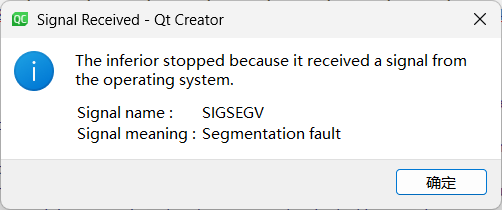
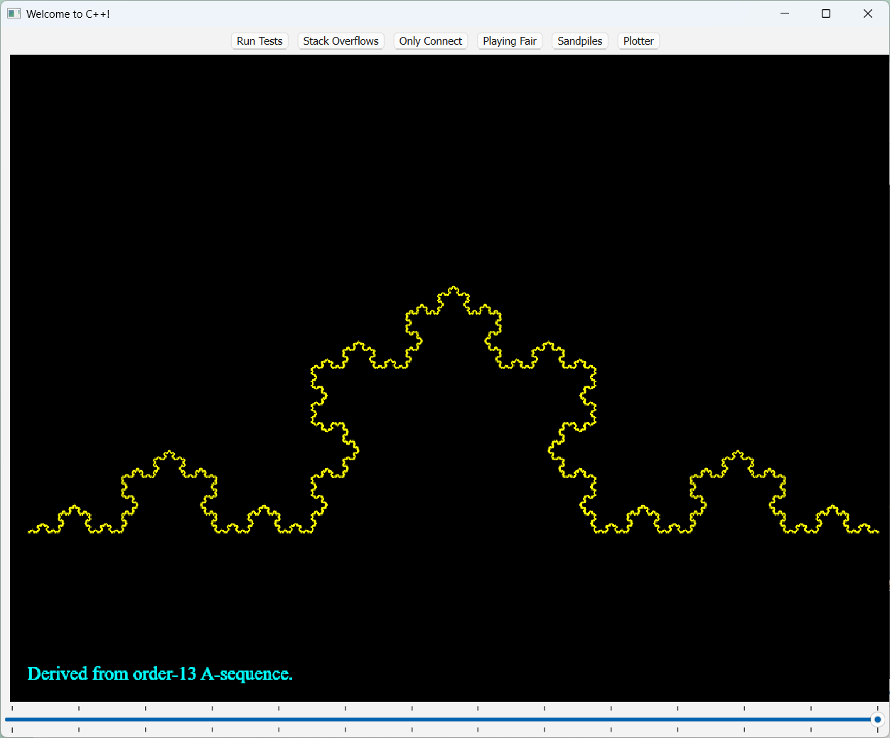
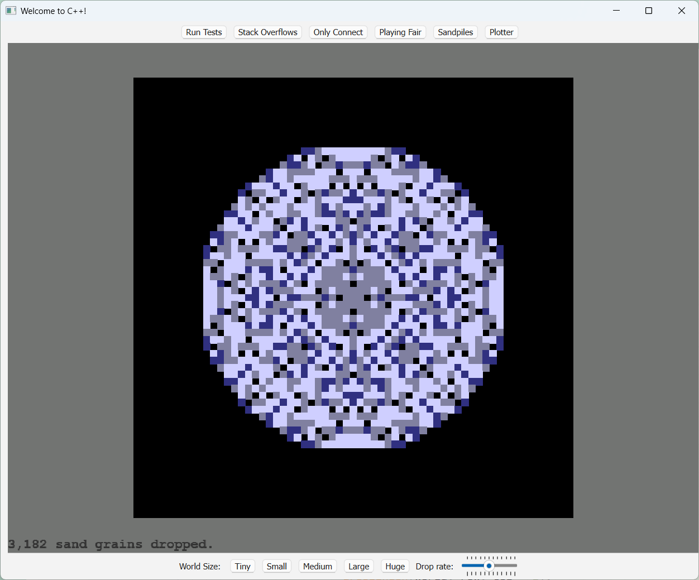
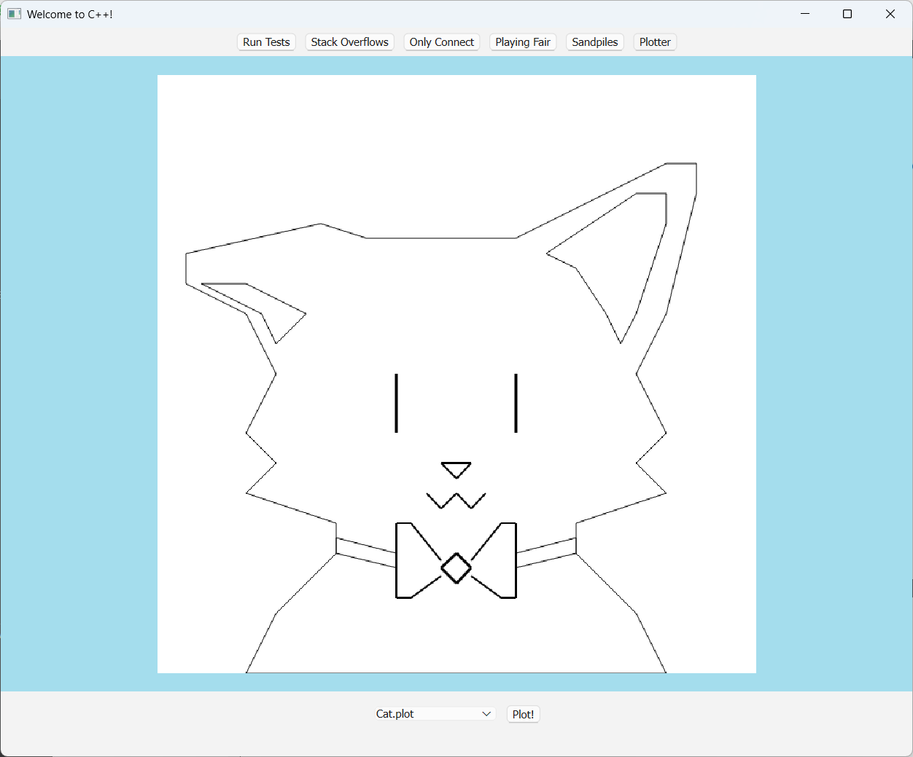
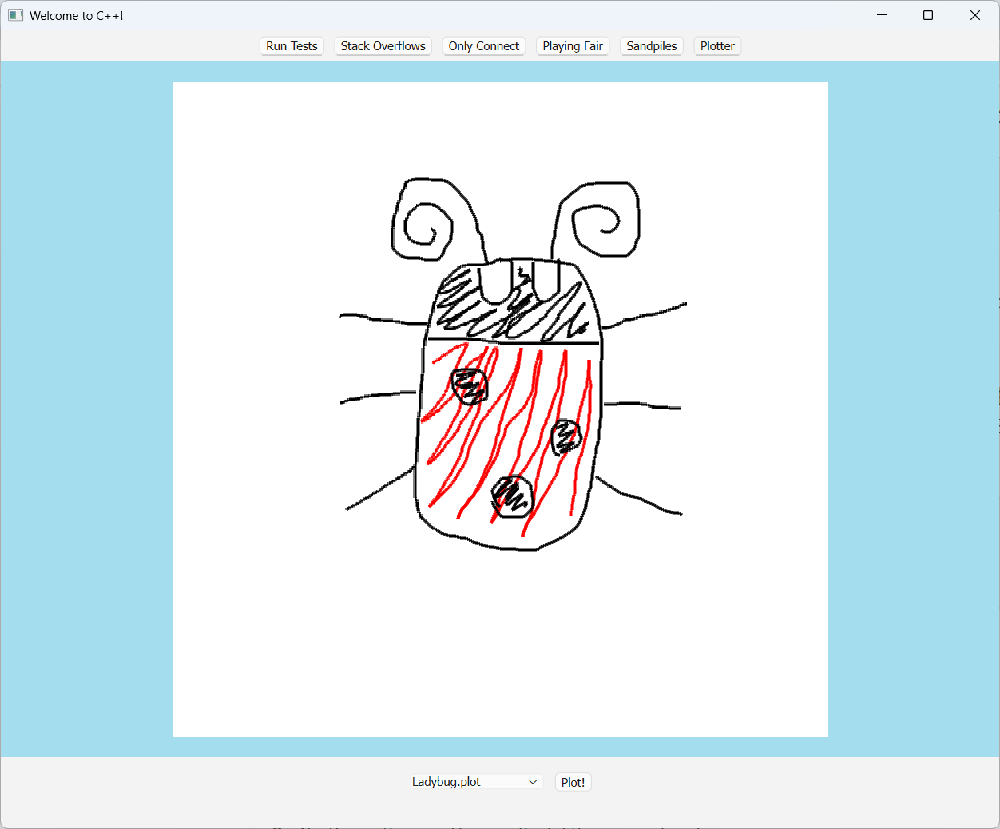

# Assignment1
[作业地址](https://web.stanford.edu/class/archive/cs/cs106b/cs106b.1224/assignments/a1/)
### Part1: Stack Overflows
```cpp
/* File: StackOverflow.cpp
 *
 * Q1: What do you see when you trigger a stack overflow when running the program without the debugger enabled? Write your answer below.
 * A1: Segmentation fault.
 *
 *
 * Q2: What is the sequence of values that repeats in the stack overflow? Write your answer below.
 * A2: 137, 164, 685, 203, 327, 549, 137.
 */
```
answer1：

answer2：单步调试每次都可以看到index

### Part2: Only Connect
> 要求：
> 1. 编写测试用例
> 2. 递归地完成`onlyConnectize`，接受一个字符串，仅保留辅音字母并转换为大写后输出

#### 1. 测试用例
```cpp
STUDENT_TEST("Handles empty string.") {
    EXPECT_EQUAL(onlyConnectize(""), "");
    EXPECT_EQUAL(onlyConnectize("aeiou"), "");
    EXPECT_EQUAL(onlyConnectize("!@#?"), "");
}
```

#### 2. 函数实现
```cpp
string onlyConnectize(string phrase) {
    // Base case
    if (phrase.empty()) {
        return "";
    }

    // Keep only consonant letters
    string ans = "";
    char c = phrase[0];

    if (isalpha(c)) {
        c = toupper(c);
        if (c != 'A' && c != 'E' && c != 'I' && c != 'O' && c != 'U') {
            ans += c;
        }
    }

    // Recursive
    return ans + onlyConnectize(phrase.substr(1));
}
```

### Part3: Playing Fair
> 1. 编写测试用例
> 2. 递归实现aSequenceOfOrder 和 bSequenceOfOrder

#### 1. 测试用例
```cpp
STUDENT_TEST("An A-sequence of order n has length 2n") {
    int n = 4;
    EXPECT_EQUAL(aSequenceOfOrder(n).length(), (1 << n));
}
```

#### 2. 函数实现
```cpp
string aSequenceOfOrder(int n) {
    // Handles error
    if (n < 0) {
        error("n must be greater than or equal to 0");
    }

    // Base case
    if (n == 0) {
        return "A";
    }

    // Recursion
    return aSequenceOfOrder(n - 1) + bSequenceOfOrder(n - 1);
}

string bSequenceOfOrder(int n) {
    // Handles error
    if (n < 0) {
        error("n must be greater than or equal to 0");
    }

    // Base case
    if (n == 0) {
        return "B";
    }

    // Recursion
    return bSequenceOfOrder(n - 1) + aSequenceOfOrder(n - 1);
}
```

#### 结果展示


### Part4: Sandpiles
> 1. 编写测试用例
> 2. 实现向沙堆扔一粒沙的函数

#### 1. 测试用例
```cpp
STUDENT_TEST("Ensure boundary cells do not cause out-of-bounds errors.") {
    Grid<int> before = {
        { 3, 0, 0 },
        { 0, 0, 0 },
        { 0, 0, 0 }
    };
    Grid<int> after = {
        { 0, 1, 0 },
        { 1, 0, 0 },
        { 0, 0, 0 }
    };

    dropSandOn(before, 0, 0);
    EXPECT_EQUAL(before, after);
}
```

#### 2. 实现递归函数
```cpp
void dropSandOn(Grid<int>& world, int row, int col) {
    if (!world.inBounds(row, col)) {
        return;
    }

    world[row][col] += 1;
    if (world[row][col] > 3) {
        world[row][col] = 0;
        dropSandOn(world, row - 1, col);
        dropSandOn(world, row + 1, col);
        dropSandOn(world, row, col - 1);
        dropSandOn(world, row, col + 1);
    }
}
```
*这个递归不需要Base case*

#### 结果展示


### Part5: Plotter
> 目标：编写runPlotterScript函数，这一部分不需要使用递归

#### 代码如下：
```cpp
#include "Plotter.h"
#include "strlib.h"
using namespace std;

void move(double& x0, double& y0, double x1, double y1, bool isPenUp, PenStyle style);

void runPlotterScript(istream& input) {
    // Initialize the plotter
    double x0 = 0, y0 = 0;
    PenStyle style = { 1, "black" };
    bool isPenUp = true;

    // 一行一行从文件读取命令
    for (string line; getline(input, line); ) {
        // Split strings
        Vector<string> command = stringSplit(line, " ");
        string c = toLowerCase(command[0]);

        // 确定命令，并执行对应操作
        if (c == "pendown") {
            isPenUp = false;
        } else if (c == "penup") {
            isPenUp = true;
        } else if (c == "moveabs") {
            double x1 = stringToReal(command[1]);
            double y1 = stringToReal(command[2]);
            move(x0, y0, x1, y1, isPenUp, style);
        } else if (c == "moverel") {
            double x1 = x0 + stringToReal(command[1]);
            double y1 = y0 + stringToReal(command[2]);
            move(x0, y0, x1, y1, isPenUp, style);
        } else if (c == "pencolor") {
            style.color = command[1];
        } else {
            style.width = stringToReal(command[1]);
        }
    }
}

// MoveAbs & MoveRel
void move(double& x0, double& y0, double x1, double y1, bool isPenUp, PenStyle style) {
    if (!isPenUp) {
        drawLine(x0, y0, x1, y1, style);
    }

    x0 = x1;
    y0 = y1;
}
```

#### 部分绘图结果展示
猫猫可爱o(=•ェ•=)m

蟑...蟑瓢虫🐞


恭喜完成Assignment1，撒花(ﾉ^ヮ^)ﾉ*:・ﾟ✧ ✿✿

---

