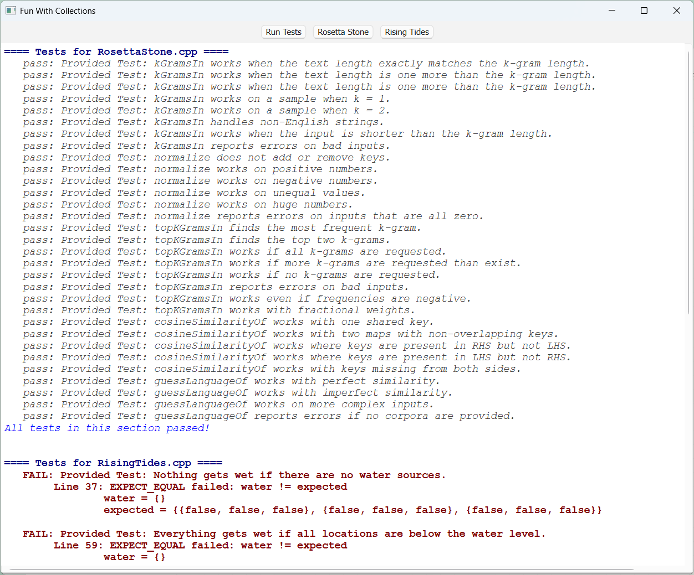
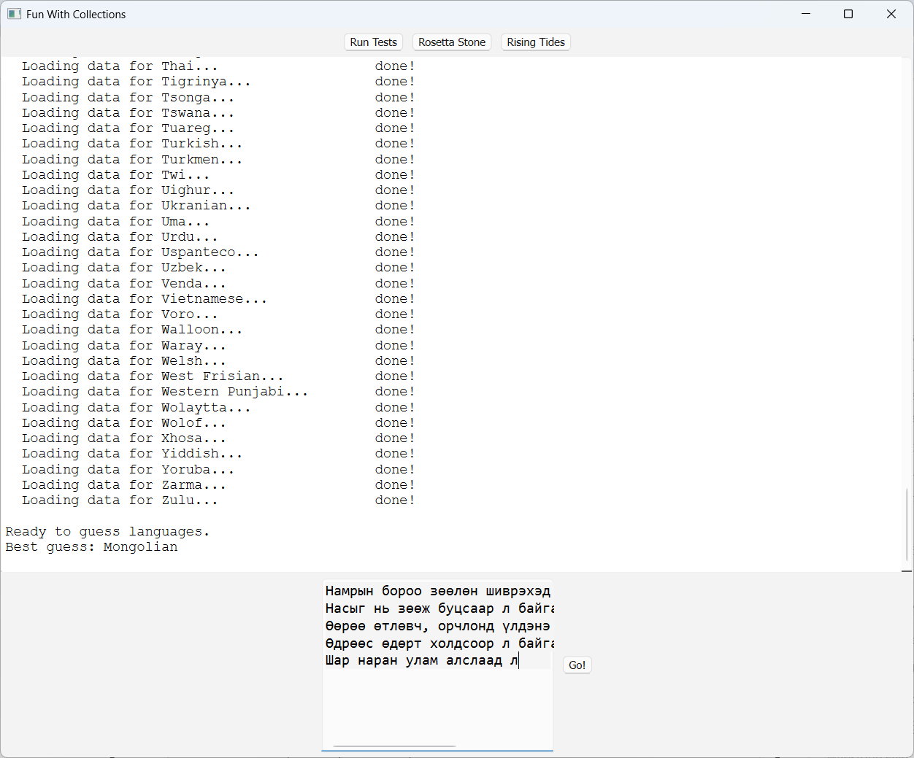
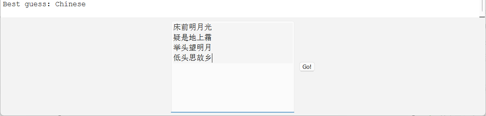
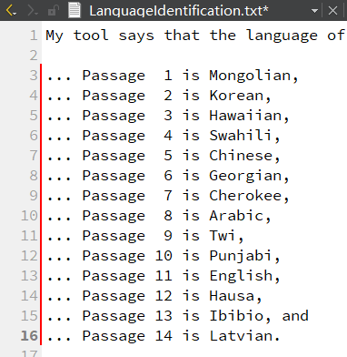
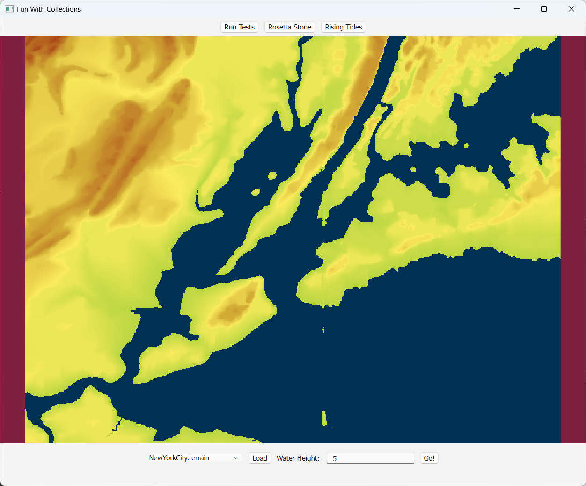

# Assignment2
> Fun with Collections
## Part1: Rosetta Stone
### Milestone One: Form k-Grams
```cpp
Map<string, double> kGramsIn(const string& str, int kGramLength) {
    if (kGramLength <= 0) {
        error("kGramLength must be positive");
    }

    Map<string, double> kGrams;
    if (str.length() < kGramLength) {
        return kGrams;
    }

    for (int i = 0; i + kGramLength <= str.length(); i++) {
        string kGram = str.substr(i, kGramLength);
        kGrams[kGram]++;
    }
    return kGrams;
}
```

### Milestone Two: Normalize Frequencies
> 要求：kGrams -> nGrams **归一化**，或者说是**向量的单位化**：将**频率向量**转换为**单位向量**，使得向量的长度（模）为1。
> 
> 1. **计算频率向量的平方和**：$S = \sum_{} f_i^2​$
> 2. **计算归一化因子**：$\sqrt{S}$
> 3. **归一化每个频率**：将每个频率除以$\sqrt{S}$就可以了
> 
> 注意：判断平方和是否为0时，直接`if (sum == 0.0)`测试无法通过，虽然不知道为什么全为0平方和的情况下也有浮点数不精确（应该是这个问题？）布尔语句改成`sum < 1`或者`sum < 1e-9`都可以。

```cpp
Map<string, double> normalize(const Map<string, double>& input) {
    if (input.isEmpty()) {
        error("Map is empty!");
    }

    double sum = 0.0;
    Map<string, double> nGrams; // normalize_frequencies_kGrams
    for (string kgram : input) {
        sum += pow(input[kgram], 2.0);
    }

    if (sum < 1) {
        error("At least one nonzero value!");
    }

    for (string kgram : input) {
        nGrams[kgram] = input[kgram] / sqrt(sum);
    }

    return nGrams;
}
```

### Milestone Three: Filter Out Uncommon Trigrams
> 要求：kGrams -> hGrams 得出最频繁的numToKeep个kGrams
> 
> 用到了优先队列，查文档后再写[PriorityQueue](http://www.martinstepp.com/cppdoc/PriorityQueue-class.html)
```cpp
Map<string, double> topKGramsIn(const Map<string, double>& source, int numToKeep) {
    Map<string, double> hGrams; // high_frequency_kGrams
    if (numToKeep < 0) {
        error("numToKeep must be positive!");
    } else if (numToKeep >= source.size()) {
        return source;
    } else if (numToKeep == 0) {
        return hGrams;
    }

    PriorityQueue<string> pq;
    for (string kgram : source) {
        pq.enqueue(kgram, source[kgram]);
    }

    while (pq.size() > numToKeep) {
        pq.dequeue();
    }

    while (!pq.isEmpty()) {
        double frequency = pq.peekPriority();
        string kgram = pq.dequeue();
        hGrams[kgram] = frequency;
    }

    return hGrams;
}
```

### Milestone Four: Implement Cosine Similarity
> 要求：找到两个nGrams的交集后，计算频率乘积的总和，即为余弦相似度。
> 
> 思想：输入两个nGrams（记为$P_1$、$P_2$），$P_1$、$P_2$是已经**归一化**的kGram频率分布，它们的频率向量是单位向量。通过计算两个向量的点积（内积），得到它们的夹角余弦值，用于衡量相似性。
> 
> 1. **找到共有的 kgram**：找到$P_1$、$P_2$中共有的kgram *(即Map中key相同的键值对)*
> 2. **计算点积**：对于每个共有的kgram，将它们在$P_1$、$P_2$中的频率对应相乘，后求和：$\sum_{} P_1(\text{kgram}) \times P_2(\text{kgram})$ *(即key相同的键值对，将它们值对应相乘，再求和)*
> 
> 公式：$\text{余弦相似度} = \cos(\theta) = \frac{\mathbf{P_1} \cdot \mathbf{P_2}}{\|\mathbf{P_1}\| \cdot \|\mathbf{P_2}\|}$
> 由于$P_1$、$P_2$都是已经归一化的单位向量，简化为$\cos(\theta) = P_1 \cdot P_2$
```cpp
double cosineSimilarityOf(const Map<string, double>& lhs, const Map<string, double>& rhs) {
    double sum = 0.0;
    for (string ngram : lhs) {
        if (rhs.containsKey(ngram)) {
            sum += lhs[ngram] * rhs[ngram];
        }
    }
    return sum;
}
```

### Milestone Five: Guess a Text’s Language
> 遍历语料库，将当前语言Profile($P_1$)与语料库中的每一种语言Profile($P_2$)都计算余弦相似度*(上一步已实现)*
> 把similarity作为优先级将language放进优先队列，dequeue到只剩下最后一种similarity值最大的language就是目标语言
```cpp
string guessLanguageOf(const Map<string, double>& textProfile,
                       const Set<Corpus>& corpora) {
    PriorityQueue<string> pq;
    for (Corpus language : corpora) {
        double similarity = cosineSimilarityOf(textProfile, language.profile);
        pq.enqueue(language.name, similarity);
    }

    while (pq.size() > 1) {
        pq.dequeue();
    }

    return pq.dequeue();
}##
```



接下来，测试我们的代码是否能正确识别语言

### Milestone Six: Explore and Evaluate



1-10是正确识别的例子，11-14是无法准确识别的例子。提出测试工具可靠性的方法（这部分跳过）

至此，Part1结束。

## Part 2: Rising Tides
> 1. 用到了bfs，有点像之前写的岛屿问题。
> 
> 2. 方向数组
```cpp
Grid<bool> floodedRegionsIn(const Grid<double>& terrain,
                            const Vector<GridLocation>& sources,
                            double height) {
    int rows = terrain.numRows();
    int cols = terrain.numCols();
    Grid<bool> flooded(rows, cols);

    Queue<GridLocation> q;
    for (GridLocation source : sources) {
        if (terrain[source.row][source.col] <= height) {
            flooded[source.row][source.col] = true;
            q.enqueue(source);
        }
    }

    while (!q.isEmpty()) {
        GridLocation location = q.dequeue();

        int r = location.row;
        int c = location.col;

        int dr[] = {-1, 1, 0, 0};
        int dc[] = {0, 0, -1, 1};

        for (int i = 0; i < 4; i++) {
            int nr = r + dr[i];
            int nc = c + dc[i];

            if (nr >= 0 && nr < rows && nc >= 0 && nc < cols
                && !flooded[nr][nc] && terrain[nr][nc] <= height) {
                flooded[nr][nc] = true;
                q.enqueue(GridLocation(nr, nc));
            }
        }
    }
    return flooded;
}
```

> 就把代码贴上来，好歹做点笔记啊喂！完全不管复习时候的自己的死活是吧Orz


恭喜完成Assignment2，耶( •̀ ω •́ )y

---

