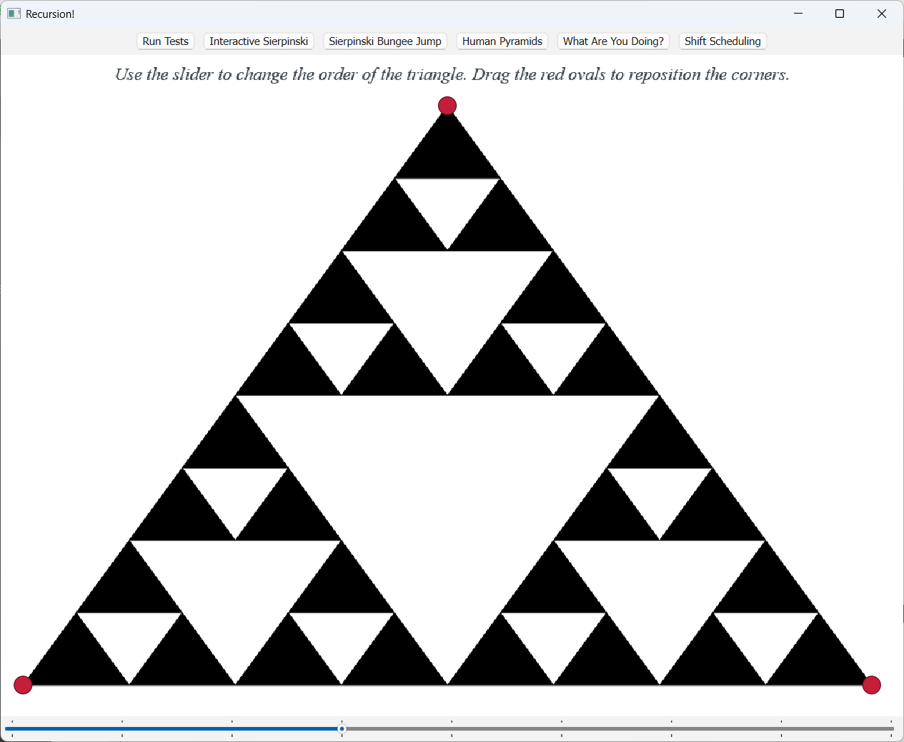
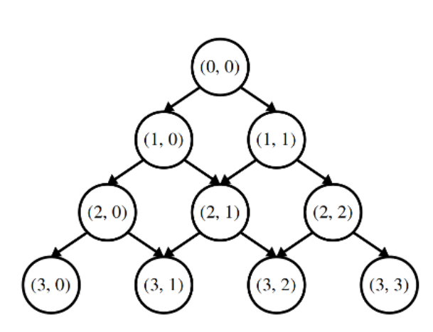
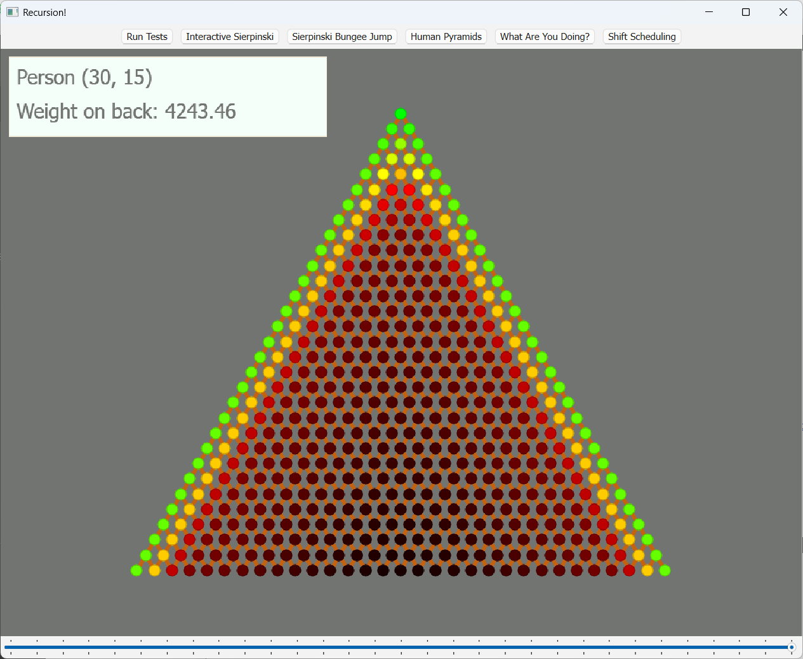
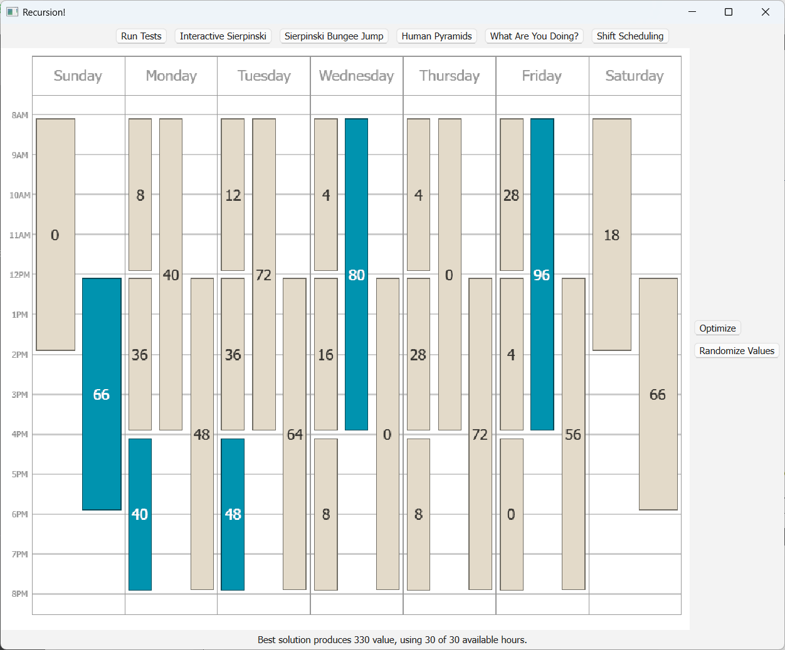

# Assignment3
> 作业地址：[Recursion!](https://web.stanford.edu/class/archive/cs/cs106b/cs106b.1224/assignments/a3/)
> 
> 备注：作业3实际应该在学完lec10**穷举搜索**和lec11**回溯法**后再写，会轻松很多。我看完lec9就写了，写得非常痛苦
## Part One: The Sierpinski Triangle
> 谢尔宾斯基三角形。

#### 代码实现
```cpp
void drawSierpinskiTriangle(GWindow& window,
                            double x0, double y0,
                            double x1, double y1,
                            double x2, double y2,
                            int order) {
    if (order < 0) {
        error("order < 0");
    } else if (order == 0) {
        drawTriangle(window, x0, y0, x1, y1, x2, y2);
    } else {
        drawSierpinskiTriangle(window, x0, y0, (x0 + x1) / 2, (y0 + y1) / 2, (x0 + x2) / 2, (y0 + y2) / 2, order - 1);
        drawSierpinskiTriangle(window, x1, y1, (x0 + x1) / 2, (y0 + y1) / 2, (x1 + x2) / 2, (y1 + y2) / 2, order - 1);
        drawSierpinskiTriangle(window, x2, y2, (x2 + x1) / 2, (y2 + y1) / 2, (x0 + x2) / 2, (y0 + y2) / 2, order - 1);
    }
}
```
#### 结果展示 


## Part Two: Human Pyramids
> 人类金字塔。
> 1. memoization



#### 代码实现
> 不愿意代码里出现多个`160`，所以声明了一个全局常量。（在静态局部变量和全局常量中选择了全局常量，虽说容易污染全局变量空间什么的，但我还是觉得这样可读性和后续修改起来更好一点）
```cpp
#include "HumanPyramids.h"
#include "hashmap.h"
using namespace std;

const double PERSON_WEIGHT = 160.0;

double weightOnBackOf(int row, int col, int pyramidHeight) {
    static HashMap<string, double> m;
    string key = to_string(row) + "," + to_string(col);

    if (m.containsKey(key)) {   // 检查是否已经计算过了
        return m[key];
    }

    if (row < 0 || col < 0 || col > row || row > pyramidHeight) {
        error("Illegal input");  // 越界访问报错
    }

    if (row == 0 && col == 0) {  // Base case
        return 0.0;
    }

    // Recursive case
    double result = 0.0;

    if (col > 0) { // 左上有人
        result += (PERSON_WEIGHT + weightOnBackOf(row - 1, col - 1, pyramidHeight)) / 2;
    }
    if (col < row) { // 右上有人
        result += (PERSON_WEIGHT + weightOnBackOf(row - 1, col, pyramidHeight)) / 2;
    }

    m[key] = result; // 缓存
    return result;
}
```

#### 结果展示


## Part Three: What Are YOU Doing?
> 这题可以参考一下课上讲的练习题`evaluate`：变量index
> 
> 1. 每次递归到终止条件得到一种可能结果currentResult
> 2. 所有currentResult加起来的集合results，就是所有可能的强调情况

```cpp
#include <cctype>
#include "strlib.h"
...
void allEmphasesOfHelper(const Vector<string>& tokens, int index, Set<string>& results, string currentResult);

Set<string> allEmphasesOf(const string& sentence) {
    Vector<string> tokens = tokenize(sentence);

    Set<string> results;
    allEmphasesOfHelper(tokens, 0, results, "");
    return results;
}

void allEmphasesOfHelper(const Vector<string>& tokens, int index, Set<string>& results, string currentResult) {
    // Base case: 遍历tokens结束
    if (index == tokens.size()) {
        results.add(currentResult);
        return;
    }

    string token = tokens[index];

    // Recursive case
    if (isalpha(token[0])) {
        // 该单词大写的情况
        string upperCase = toUpperCase(token);
        allEmphasesOfHelper(tokens, index + 1, results, currentResult + upperCase);

        // 该单词小写的情况
        string lowerCase = toLowerCase(token);
        allEmphasesOfHelper(tokens, index + 1, results, currentResult + lowerCase);
    } else { // 跳过非字母
        allEmphasesOfHelper(tokens, index + 1, results, currentResult + token);
    }
}
```

## Part Four: Shift Scheduling
> lengthOf()返回班次的工作时长，valueOf()返回班次带来的价值、overlapsWith()比较两个班次是否冲突
> 
> lec11课堂练习`sublists`和这题类似

```cpp
思路：

// 递归终止条件
if（没有剩余班次了：即本次递归调用的【剩余的班次】集合已经为空）{
	返回【已分配的班次集合】
}

取出一个班次
	// Recursive case
	if (超时 || 班次冲突) {
		不选择该班次
		递归【剩余的班次】
	}
	else {
		1. 不选择该班次
			- 直接递归【剩余的班次】
		2. 选择该班次
			- 将该班次添加到【已分配的班次】中，然后递归剩余的班次
	}
	
	比较选择/不选择该班次的value值
		return value更大的Set<Shift>
```
中间部分去掉if-else语句，简化为：
```cpp
	// Recursive case
	不选择该班次 
		- 递归【剩余的班次】

	if (没超时 && 班次不冲突) {
		选择该班次
			- 将该班次添加到【已分配的班次】中，然后递归剩余的班次
	}
```

#### 代码实现
```cpp
Set<Shift> highestValueScheduleForHelper(const Set<Shift>& shifts, int maxHours, Set<Shift>& assigned);

Set<Shift> highestValueScheduleFor(const Set<Shift>& shifts, int maxHours) {
    if (maxHours < 0) {
        error("Illegal maxHours");
    }

    Set<Shift> assigned;
    return highestValueScheduleForHelper(shifts, maxHours, assigned);
}

Set<Shift> highestValueScheduleForHelper(const Set<Shift>& shifts, int maxHours, Set<Shift>& assigned) {
    // Base case: 
    if (shifts.isEmpty()) {
        return assigned;
    }

    Shift currentShift = shifts.first();
    Set<Shift> remainingShifts = shifts - currentShift;

    bool overlapped = false;
    for (Shift s : assigned) {
        if (overlapsWith(s, currentShift)) {
            overlapped = true;
            break;
        }
    }

    int currentTime = lengthOf(currentShift);
    bool overtime = (currentTime > maxHours) ? true : false;

    Set<Shift> selected = assigned;
    Set<Shift> unselected = assigned;
    
    // 所有的Shift都有“不选择”的情况
    unselected = highestValueScheduleForHelper(remainingShifts, maxHours, unselected);    

    if (!overtime && !overlapped) { // 只有满足条件的Shift才能在当前这次可能结果中“选择”
        selected += currentShift;
        selected = highestValueScheduleForHelper(remainingShifts, maxHours - currentTime, selected);
    }

    int v1 = 0;
    for (Shift s : unselected) {
        v1 += valueOf(s);
    }

    int v2 = 0;
    for (Shift s : selected) {
        v2 += valueOf(s);
    }

    return (v1 > v2) ? unselected : selected;
}
```
懒得写测试用例了\_ (:з」∠)\_

#### 结果展示


> 恭喜完成Assignment 3！
> 
> 这次作业是目前耗时最久最难的一次，Part 1、2还比较容易，到Part 3就需要好好思考了，Part 4更是尝试了好久好久。
> 
> ~~应该还可以优化，我累了~~

---

