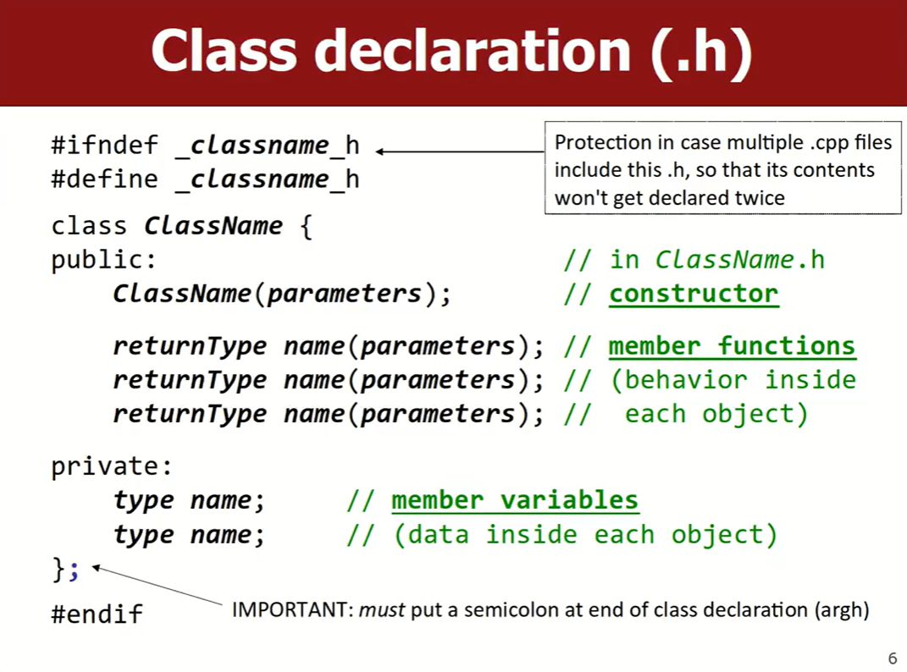
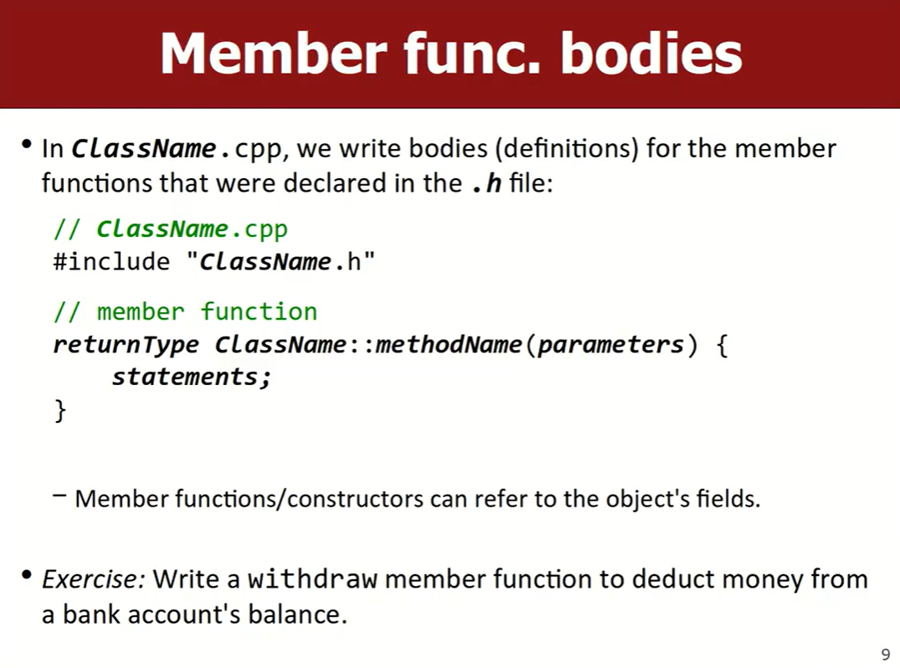
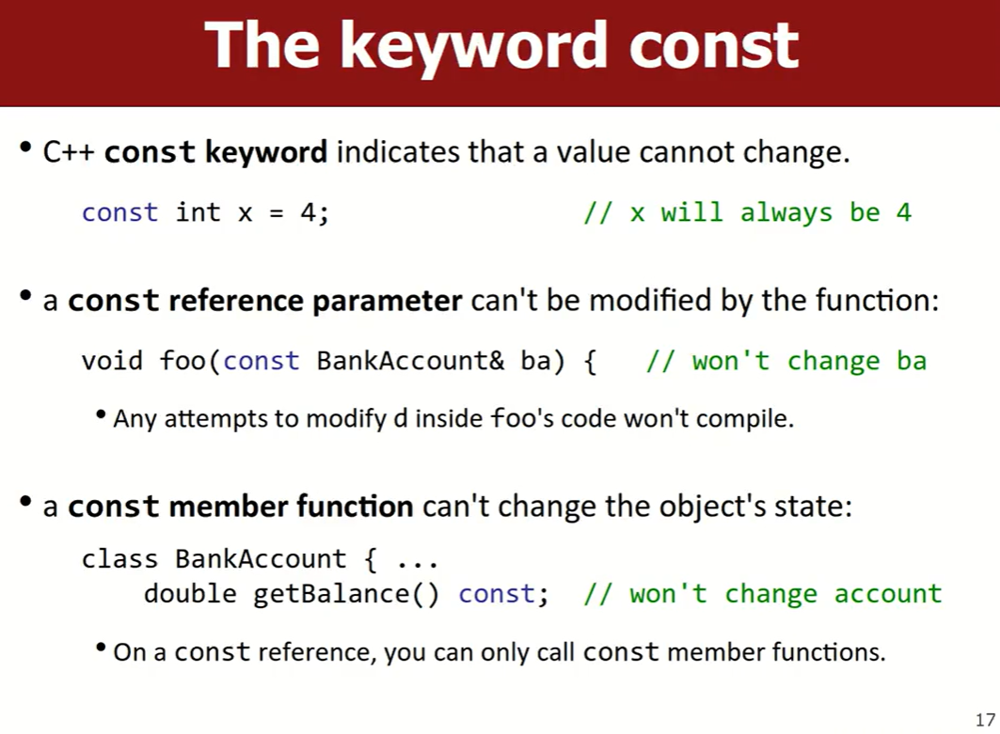
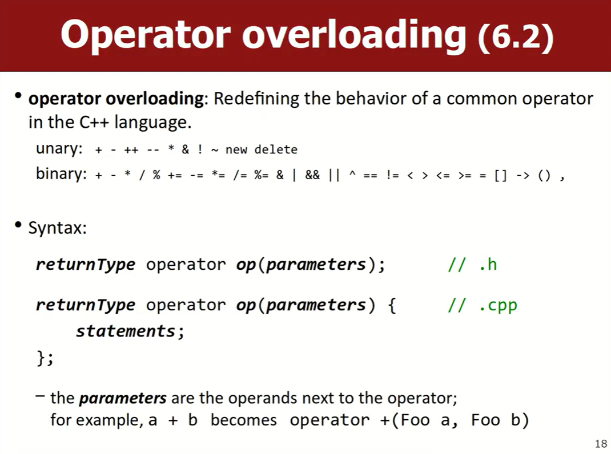
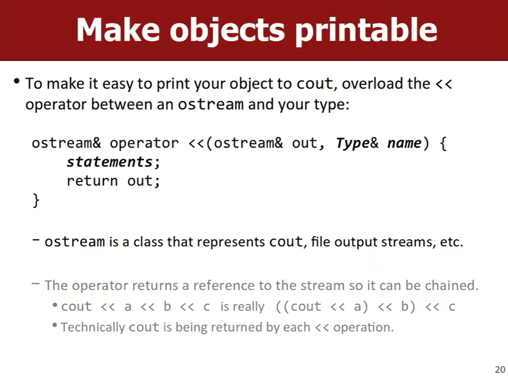
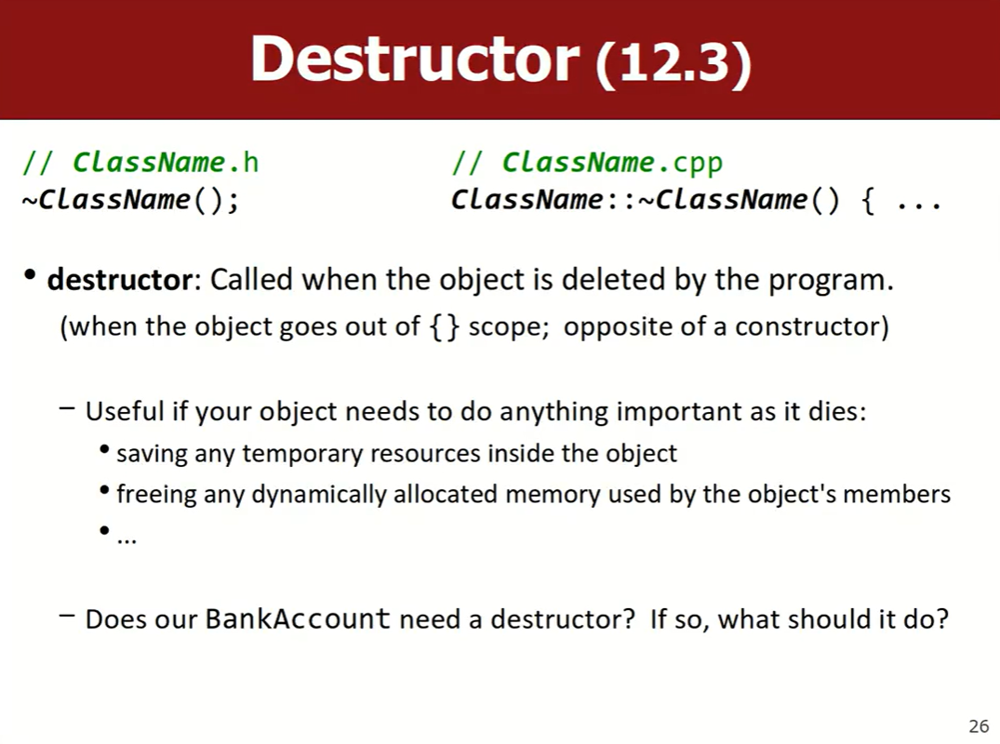

# Lec16-17_Classes
💻课后练习：

- [x] [1. Circle](https://www.codestepbystep.com/problem/view/cpp/classes/Circle)
	- 头文件和实现文件分开写当然好，但这种答题都是放在一起的，别写习惯了搞忘了:0
- [x] [2. Date](https://www.codestepbystep.com/problem/view/cpp/classes/Date)
	- 用到了我讨厌的ostringstream :(


- 在C++中编写类，包含`.h`与`.cpp`两个文件

## 头文件.h
```cpp
#ifndef _classname_h
#define _classname_h

class classname {
public:
	// 构造函数声明
	
	// 公有函数声明
	
private:
	// 私有成员变量声明
};

#endif
```


写一个示例：
```cpp
// BankAccount.h
#ifndef _bankaccount_h
#define _bankaccount_h

#include <iostream>
#include <string>
using namespace std;

class BankAccount {
public:
	BankAccount(string n, double bal = 0.00);
	~BankAccount();
	void deposit(double amount);
	void withdraw(double amount);
	string getName() const;
	double getBalance() const;

	// friend
	friend bool operator ==(const BankAccount& ba1, const BankAccount& ba2);
	friend bool operator !=(const BankAccount& ba1, const BankAccount& ba2);
private:
	string name;
	double balance;
};

bool operator ==(const BankAccount& ba1, const BankAccount& ba2);
bool operator !=(const BankAccount& ba1, const BankAccount& ba2);

ostream& operator <<(ostream& out, const BankAccount& ba);
```

## 实现文件.cpp


写一个示例：
```cpp
// BankAccoount.cpp
#include "bankaccount.h"

// 构造函数实现
BankAccount::BankAccount(string n, double bal) {
	if (bal < 0) {
		throw bal;
	}
	name = n;
	balance = bal;
}

// 析构函数实现
BankAccount::~BankAccount() {
	cout << "destructor called for " << *this << endl;
}

// 成员函数实现
void BankAccount::deposit(double amount) {
	if (amount >= 0.00) {
		balance += amount;
	}
	// this->balance
}

void BankAccount::withdraw(double amount) {
	if (balance >= amount && amount >= 0.00) {
		balance -= amount;
	}
}

string BankAccount::getName() const{
	return name;
}

double BankAccount::getBlance() const{
	return balance;
}

// 操作符重载
bool operator ==(const BankAccount& ba1, const BankAccount& ba2) {
	return ba1.name == ba2.name && ba1.balance == ba2.balance;
}

bool operator !=(const BankAccount& ba1, const BankAccount& ba2) {
	return !(ba1 == ba2);
}

ostream& operator <<(ostream& out, const BankAccount& ba) {
	out << ba.getName() << ", " << "$" << ba.getBalance();
	return out;
}
```

## 客户端文件.cpp
```cpp
#include "bankaccount.h"
using namespace std;

int main() {
	BankAccount ba1("Meng");
	ba1.deposit(3.00); // m -> 3 :)
	cout << "My balance is " << ba1.getBalance() << endl;

	BankAccount ba2("Ju", 7.00); // J -> 7 :D

	// 操作符重载
	if (ba1 != ba2) {
		cout << ":P" << endl;
	}
	if (ba1 == ba1) {
		cout << ":)" << endl;
	}

	cout << "ba1 is: " << ba1 << endl;
	cout << "ba2 is: " << ba2 << endl;
}
```

## const

声明了 const 的成员函数，表示函数不能修改对象的字段（类中的成员函数才把 const 放在最后，如果是全局函数不需要）

## 操作符重载


```cpp
// .h
#include <iostream>
...
ostream& operator <<(ostream& out, const BankAccount& ba);
// .cpp
ostream& operator <<(ostream& out, const BankAccount& ba) {
	out << ba.getName() << ", " << "$" << ba.getBalance();
	return out;
}
```

## 析构函数destructor


---

