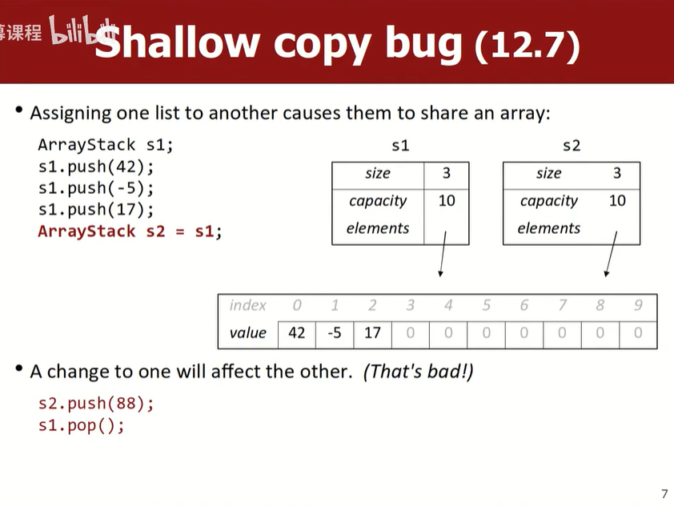

# Lec18_Arrays
能自己写出整个ArrayStack类实现这讲就算结束

声明数组：
```cpp
type* name = new type[length]; // uninitialized
type* name = new type[length](); // initialize to 0

int* a = new int[3];
int* a2 = new int[3]();
```

vector内部实现：int size + int capacity + array


## 实现ArrayStack类
```cpp
// arraystack.h
#ifndef _arraystack_h
#define _arraystack_h

#include <iostream>
using namespace std;

class ArrayStack {
public:
	ArrayStack();
	~ArrayStack();

	void push(int n);
	int pop();
	int peek() const;
	bool isEmpty() const;
	
	friend ostream& operator <<(ostream& out, const ArrayStack& stack);
	
private:
	int size;
	int capacity;
	int* elements;

	ArrayStack(const ArrayStack& other);
	ArrayStack& operator =(const ArrayStack& other);
};

ostream& operator <<(ostream& out, const ArrayStack& stack);

#endif
```

```cpp
// arraystack.cpp
#include "arraystack.h"

ArrayStack::ArrayStack() {
	size = 0;
	capacity = 10;
	elements = new int[capacity]();
}

ArrayStack::~ArrayStack() {
	delete[] elements;
}

void ArrayStack::push(int n) {
	if (size >= capacity) {
		int* bigger = new int[capacity * 2];
		for (int i = 0; i < size; i++) {
			bigger[i] = elements[i];
			delete[] elements;
			elements = bigger;
			capacity *= 2;
		}
	}
	elements[size] = n;
	size++;
}

int ArrayStack::pop() {
	if (isEmpty()) {
		throw "Empty stack!";
	}
	int result = elements[size - 1];
	size--;
	return result;
}

int ArrayStack::peek() const {
	if (isEmpty()) {
		throw "Empty stack!";
	}
	return elements[size - 1];
}

bool ArrayStack::isEmpty() const {
	return size == 0;
}

ostream& operator <<(ostream& out, const ArrayStack& stack) {
	out << "{";
	if (!stack.isEmpty()) {
		out << stack.elements[0];
		for (int i = 1; i < size; i++) {
			out << ", " << stack.elements[i];
		}
	}
	out << "}";
	return out;
}
```

```cpp
// stack_client.cpp

```


## 浅拷贝问题


- copy constructor
- `=` operator overload

```cpp
...
private:
	ArrayStack(const ArrayStack& other);
	ArrayStack& operator =(const ArrayStack& other);
```


## template
讲座没时间讲，看18年的PPT

---

