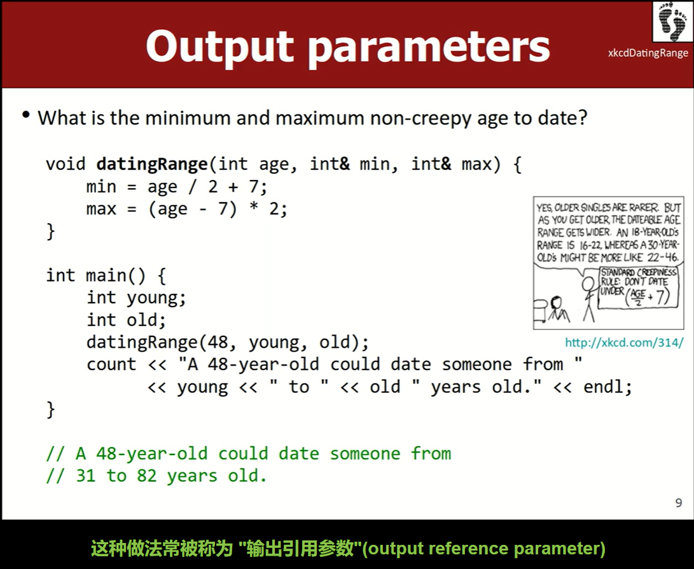
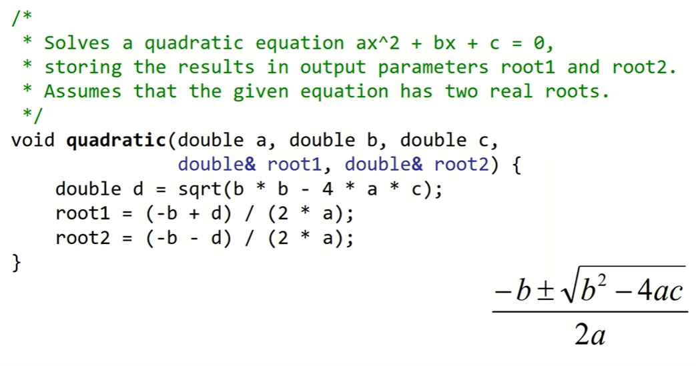

# Lec2_functions
> lec2课堂练习：
> 
> - [x] [parameterMysteryBCA](https://www.codestepbystep.com/problem/view/cpp/parameters/parameterMysteryBCA)
> - [x] [xkcdDatingRange](https://www.codestepbystep.com/problem/view/cpp/parameters/xkcdDatingRange)
> - [x] [quadratic](https://www.codestepbystep.com/problem/view/cpp/parameters/quadratic)
> - [x] [returnMystery1](https://www.codestepbystep.com/problem/view/cpp/parameters/returnMystery1)
> - [x] [BMI](https://www.codestepbystep.com/problem/view/cpp/parameters/BMI)
> - [x] [stringMysteryAB](https://www.codestepbystep.com/problem/view/cpp/strings/stringMysteryAB)
> - [x] [nameDiamond](https://www.codestepbystep.com/problem/view/cpp/strings/nameDiamond)

#### 课堂内容

!!! important
	### 按引用传递
	#### 1. 非const左值引用（Type&）：`void func(int& a) {...}`
	非 `const` 引用只能绑定到左值（lvalue），不能绑定到右值（rvalue）。左值是指有明确存储地址、可以取地址的表达式，通常是**变量**；右值是指临时对象、**字面量**等，没有明确的存储地址，不能取地址。
	```cpp
	void func(int& a) {...} // 此时调用`func(3)`是非法的。
	```


	因为非 `const` 左值引用意味着可以通过该引用修改所绑定的对象，而右值（字面量 `3`）是临时的，不允许被修改，所以非 `const` 左值引用不能绑定到右值。

	#### 2. const引用（const Type&）：`void func(const int& a) {...}`
	`const` 引用既可以绑定到左值，也可以绑定到右值。当绑定到右值时，会创建一个临时对象，并将该临时对象的引用绑定到 `const` 引用参数上。

	```cpp
	void func(const int& a) {...} // 此时调用`func(3)`是合法的	
	```

	因为 `const` 修饰表明不会通过该引用去修改所绑定的对象，所以允许它绑定到右值。当把一个右值（如 `3`）传递给 `const` 左值引用时，编译器会创建一个临时对象，将右值存储在这个临时对象中，然后让 `const` 左值引用绑定到这个临时对象上。


说明：标\*表示以前学过的

- cout
- cin *// bad*
- simpio.h *// 用 getInteger() 等函数代替cin*
- console.h *// 将控制台作为独立窗口弹出*
- 系统库用尖括号`#include <iostream>`，本地库用引号`#include "simpio.h"`
- 有默认值的函数参数 >> 必须在参数列表末尾
	- `void func(int a = 1, int b);`是非法的
- 每个项目最终只能有一个 `main()` 函数作为入口。如果希望两个 cpp 文件共同工作，就需要调整文件逻辑，把一个文件的功能拆分为可调用的函数，而另一个文件负责程序入口。
- [!] 注意到 C++ 里面无参数函数声明时`int func();` 并不像 C 中一样用`void`显式表示“无参数”，原因是 C 和 C++ 对`()`的语义解释不同。
	1. 在 C 中，`int func();`这种没有 void 的写法被解释为 **参数未指定** ，即可以接受任意数量和类型的参数，`func(10)`的调用是合法的，所以如果没有参数的函数定义必须明确使用`void`；
	2. 而在 C++ 里，空括号则明确表示该函数 **没有参数** ，与`void`含义相同。`int func();`和`int func(void);`是一样的。
- 和 C 中一样，因为编译器是从上到下遍历代码的，所以如果辅助函数写在 main 函数后面，在 main 中调用辅助函数时会报错。需要先在最前面加一行函数原型 ( function prototype ) 。（在 Java 和 Python 中不需要这样）\*
	- [?] 当函数原型和函数定义分开时处理默认参数：
	- 前面的函数原型`void func(int n = 2);`
	- 后面的函数定义`void func(int n) {...}`
- `value semantics`和`reference semantics`。同样用swap来讲解。（一些语言会根据数据类型决定使用哪种语义，如果是基本数据类型比如int，则会按值传递；如果是对象或数组，则会按引用传递。）但在C++中可以选择自己想要的语义。`void swap(int a, int b)`是按值传递，`void swap(int& a, int& b)`是按引用传递。
- 引用参数的利弊
	- 通过引用参数，可以 “ return ” 多个值。一次“返回”两个值的例子：
		
	- 用于对象时可以避免大量的拷贝
	- 但代码变得难以理解，当调用`func(a, b)`时，如果不看func函数实现并不能知道a和b是按何种方式传递，是否能被修改。
	- 字面值(如 123 ， "abc" )可以作为值参数传递，但不能作为引用参数传递。只能将变量作为引用参数，因为实际传入的引用是变量在内存中的地址。
		- 如`void func(int a)`，调用时可以func(123)；
		- 但`void func(int& a);`， ~~func(123)~~ 是不合法的。正确调用应先将整数存进变量中`int n = 123;`，再将变量作为函数参数传递`func(n)`
	- 例子：上述图片中的`void datingRange(int age, int& min, int& max)`。 age 是值语义，调用时可以直接用"48"`datingRange(48, young, old)`，也可以先`int a = 48`，再将变量 a 传入`datingRange(a, young, old)`；但 min 和 max 是引用语义，必须将变量作为参数， ~~datingRange(48, 0, 0)~~ 调用是不合法的。
- 课程结束前的最后一个例子，计算方程的根（假设有两个根）

	❓请思考函数的返回值、函数应该接受的参数、以及参数是按值还是按引用传递

	- [x] 3 个按值传递的参数 a、b、c ，两个按引用传递的参数 x1、x2（通过引用传递一次“返回”两个值），函数不需要返回值`void`。
	

---

