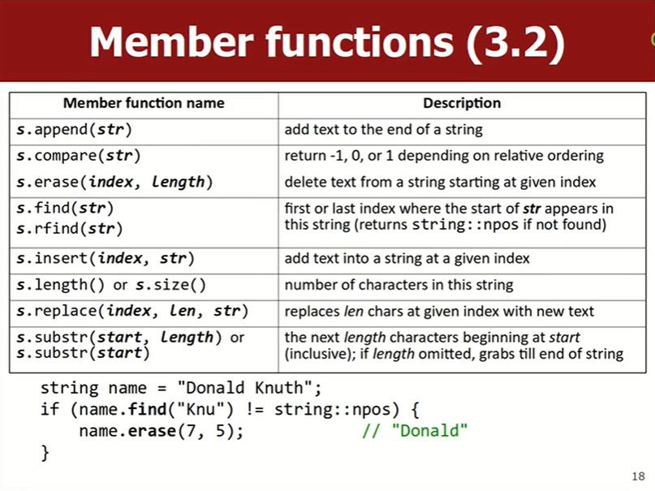
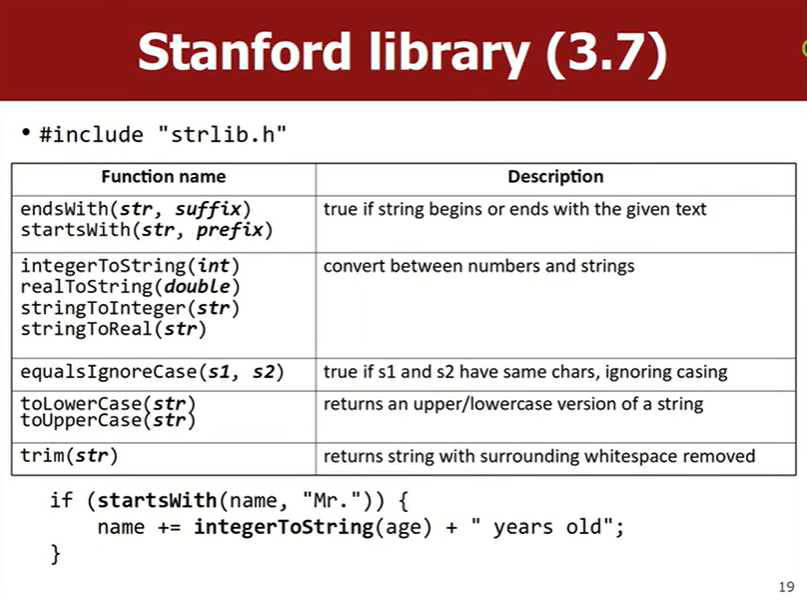
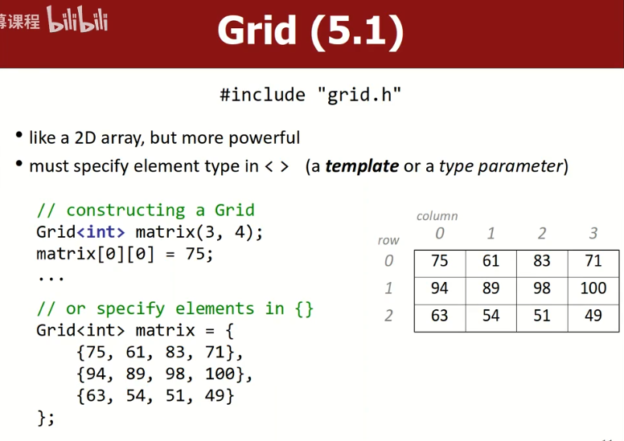
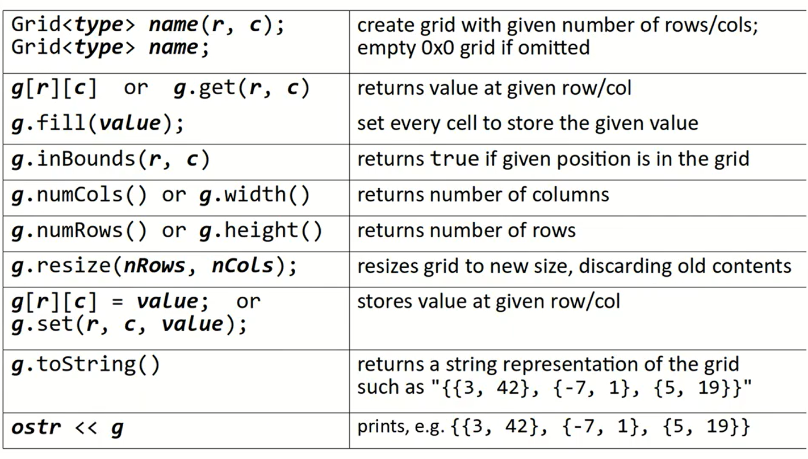
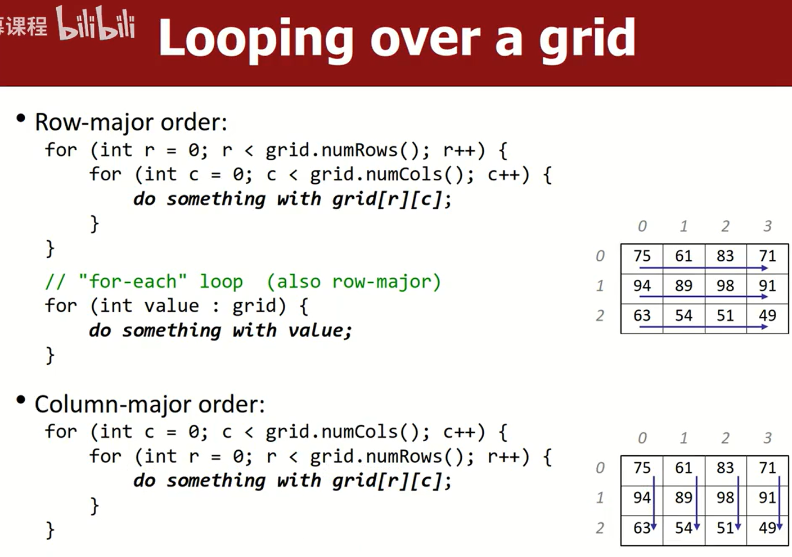

# Lec3_Strings
💻lec3课堂练习：

- [x] [1. streamErrors](https://www.codestepbystep.com/problem/view/cpp/streams/streamErrors)
不喜欢写文件流的题，不写了
### string
- `#include <string>`
- `using namespace std; // std::string`
- 字符串的连接`+`：s1 + s2
- 字符串可以通过`>`和`<`进行比较，基于ASCII码的大小（大写字母的ASCII码比小写字母的要小）
- 与C不同，在C++中可以直接通过“\==”比较两个字符串相等，如`if (s == "abc") {...}`。原因是C++的语言特性：操作符重载。重新定义操作符，以让他们处理不同的数据类型

1. 下面是string的一些成员函数。

- 改变字符串（直接在原来的字符串上修改而不是返回一个新的string
	- string s1 = "que"
	- s1.append("ue"); *// "queue"*
	- s1.erase(3, 2) *// 删除下标 3 开始的 2 个字符*
- 字符串长度`s.length()`或`s.size()`
	- 标准库实现在`std::string` 内部维护一个成员变量来记录字符串的长度，每次调用 `length()` 时只需返回这个已保存的值，不需要遍历整个字符串。时间复杂度为$O(1)$。多次调用也几乎没有额外开销。
	- 这与C中常用的`string.h`库中的`strlen()`不同，`strlen()` 必须遍历字符数组，查找终止的 `\0` 来计算字符串的长度，时间复杂度为$O(n)$。如果在循环中频繁调用可能会带来较高的开销。
- find()和rfind()
	- `s1.find(str)` s1中是否存在子串str。
	- 当返回`string::npos`(no position)时表示未找到。条件判断：`if (s.find(target) != std::string::npos)`


2. 斯坦福库的额外方法`#include "strlib.h"


↑注意这些不能用点符号，而是需要把String对象作为参数传入函数
- `cin`一次性只能读一个单词，比如
```cpp
string name;
cin >> name; // 输入：David Malan
cout << "Hello, " << name << endl; // 输出：Hello, David
```
如果希望读一整行输入，可以调用斯坦福库"strlib.h"中的getLine()函数：
```cpp
string name = getLine("What's your name? "); // 输入：David Malan
cout << "Hello, " << name << endl; // 输出：Hello, David Malan
```
C++标准库中还有一个很相似的函数`getline()`：
```cpp
string name;
cout << "What's your name? ";
getline(cin, name); // 输入：David Malan
cout << "Hello, " << name << endl; // 输出：Hello, David Malan
```
它接受两个参数：从哪读取、存到哪去。没有返回值（说明name是作为引用参数传递的）

- [nameDiamond](https://codestepbystep.com/r/problem/view/cpp/strings/nameDiamond)

- **C string 和 C++ String**
	- C中的string是字符数组`char*`，没有C++ String中的成员函数可以使用
	- 当在程序中直接写"Hello", "world"时，是C String
	- 当`string s = "Hello";`时，会转化为C++ String
	- 一个容易出错的例子：`string s = "Hello " + "world";`
	- 右边"Hello "和"world"都是C String，并不能像C++ String一样通过"+"直接连接。不过编译器也不会报错，实际会进行指针运算，让两个地址相加后赋值给变量s，导致预期外的内存操作，造成程序崩溃。
	
	- 可以通过`string("hi")`转换为C++ string，两个string中只要有一个string是C++ string，用"+"连接时会自动转换为C++ string
#### 遍历字符串
1. `[]`访问下标
2. 范围-based for 循环`for (char c : str)`

#### 检查字符串是否为空
`if (s.empty()) {...}`

### stream
1. **fstream文件流**

ifstream输入流从文件中读取数据
```cpp
#include <fstream>
#include <string>
...
ifstream inFile;
inFile.open("filename.txt"); // 也可以ifstream inFile("filename.txt");
if (!inFile) { // 检查文件是否成功打开 
	cerr << "无法打开文件！" << endl;
	return 1; 
}

string line;
while (getline(inFile, line)) { // 逐行读取
	cout << line << endl;
}

inFile.close();
```
也可以逐个单词读取：
```cpp
string word;
while (inFile >> word) {
	cout << word << endl;
}
```
`inFile >> word`遇到空格或换行时会停止。while循环中，当没有数据可读时，`inFile`会变成EOF状态，结束循环。

2. **sstream字符串流**

**istringstream** 将字符串当作输入流从中读取数据。常用于解析字符串中的数据
```cpp
#include <sstream>
#include <string>
...
istringstream input("CS50x 2025");
string s;
int i;
input >> s >> i;
cout << "This is " << s << " " << i;
// This is CS50x 2025
```
**ostringstream** 输出流，它允许你将数据写入字符串（实际上是一种高效构建、累计字符串的方式），而不是直接写到控制台或者文件。这使得它非常适合于字符串拼接、格式化或者缓存数据以便后续使用。`<<`运算符将数据写入流，通过`str()`方法获取生成的字符串。
```cpp
ostringstream output;
int year = 2025;
output << "This is CS50x " << year; // 将数据写入流
string s = output.str();
cout << s << endl;
// This is CS50x 2025
```

3. 斯坦福库`filelib.h`


### grid
!!! quote
	When a Grid is passed by value, C++ makes a copy of its contents.

	Copying is slow; you should usually **pass by reference** with **&**
	If the code wont't modify the grid, also pass it as **const**

	Like `int func(const Grid<int>& g) {...}`
	&可以保证不复制Grid，提高效率，但按引用传递可以直接更改Grid的内容，如果不希望Grid被函数更改，再加上const

`Grid<int> matrix(3, 4);`



遍历Grid：



---

