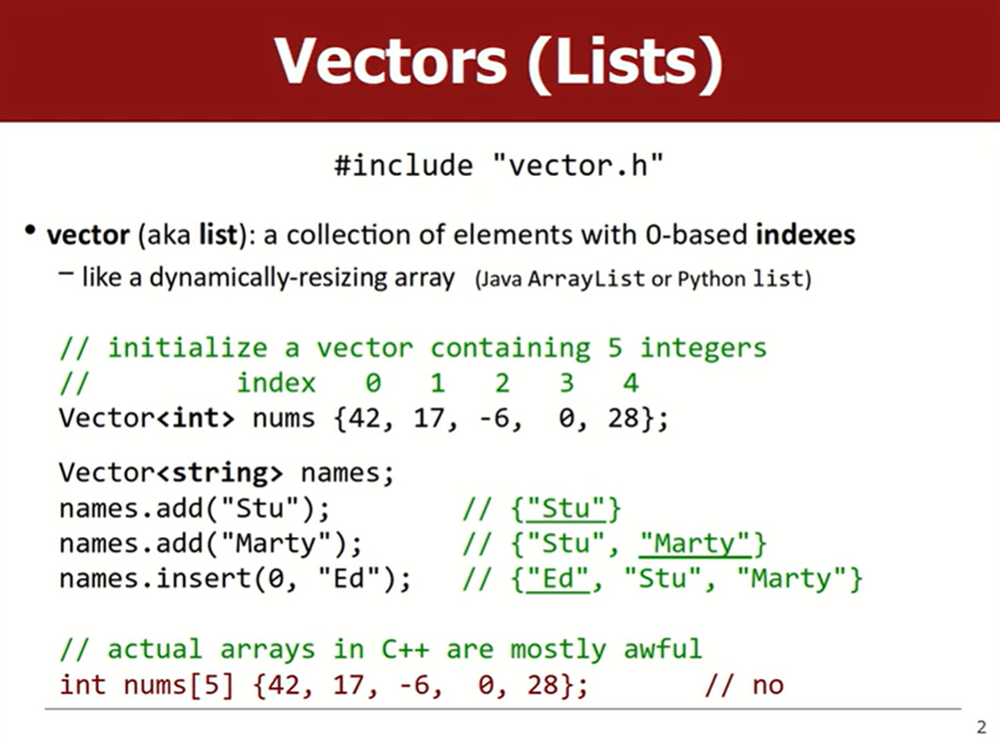
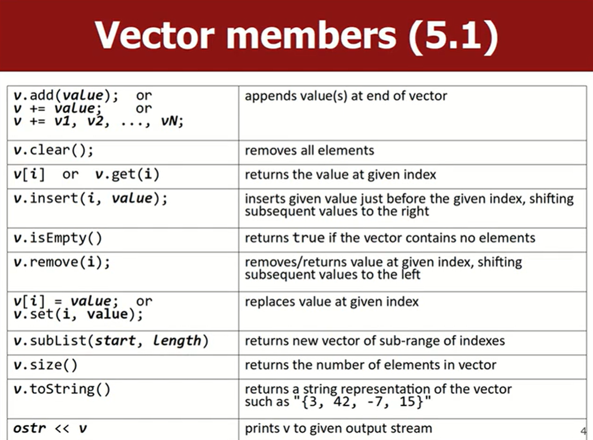
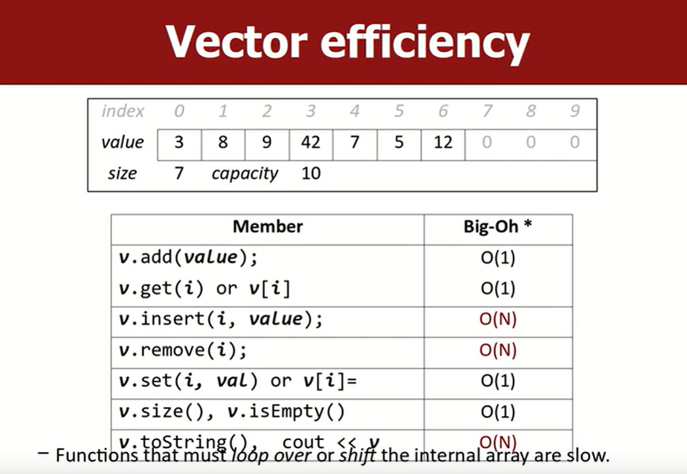

# Lec4_Vector
> 💻lec4练习题：
> 
> - [x] [1. vectorMysteryRemove](https://www.codestepbystep.com/problem/view/cpp/collections/vector/vectorMysteryRemove)
> - [x] [2. vectorMysteryInsert](https://www.codestepbystep.com/problem/view/cpp/collections/vector/vectorMysteryInsert)
> - [x] [3. countInRange](https://www.codestepbystep.com/problem/view/cpp/collections/vector/countInRange)
> - 前三题好无聊
> - [x] [4. removeAll](https://www.codestepbystep.com/problem/view/cpp/collections/vector/removeAll)注意删除元素要从后开始遍历vector
> - [x] [5. addStars](https://www.codestepbystep.com/problem/view/cpp/collections/vector/addStars)
> - [x] [6. intersect](https://www.codestepbystep.com/problem/view/cpp/collections/vector/intersect)双指针(索引)

#### 练习题5：addStars
> 练习reserve()、swap()
```cpp
void addStars(vector<string>& v) {
    int size = v.size() * 2 + 1;
    for (int i = 0; i < size; i += 2) {
        v.insert(v.begin() + i, "*");
    }
}
```
insert的时间复杂度是$O(n)$

```cpp
void addStars(vector<string>& v) {
    int newSize = v.size() * 2 + 1;
    vector<string> res;
    res.reserve(newSize);
    
    for (int i = 0; i < v.size(); ++i) {
        res.push_back("*");
        res.push_back(v[i]);
    }
    res.push_back("*");
    
    v.swap(res);
}
```

### Vector
- `include "vector.h"`
- 斯坦福库里的是`Vector`，不是C++标准库里的`vector`
- vector包含一个`array`，一个`size`，一个`capacity`
- 这一讲在解释“为什么`Vector<Vector<int> > vv;`右边多了一个空格”时非常好笑哈哈哈


写一个课堂代码：
```cpp
// Vector<string> v {"a", "b", "b", "c", "a", "b"};
// removeAll(v, "b")
void removeAll(Vector<string>& v, string s) {
	for (int i = v.size(); i >= 0; i--) {
		if (v[i] == s) {
			v.remove(i);
		}
	}
}
```
注意这里为什么要从末尾开始遍历

### Big-O
这部分都是在CS50学过的，没有新东西，也没有CS50讲得更直观易懂


---

