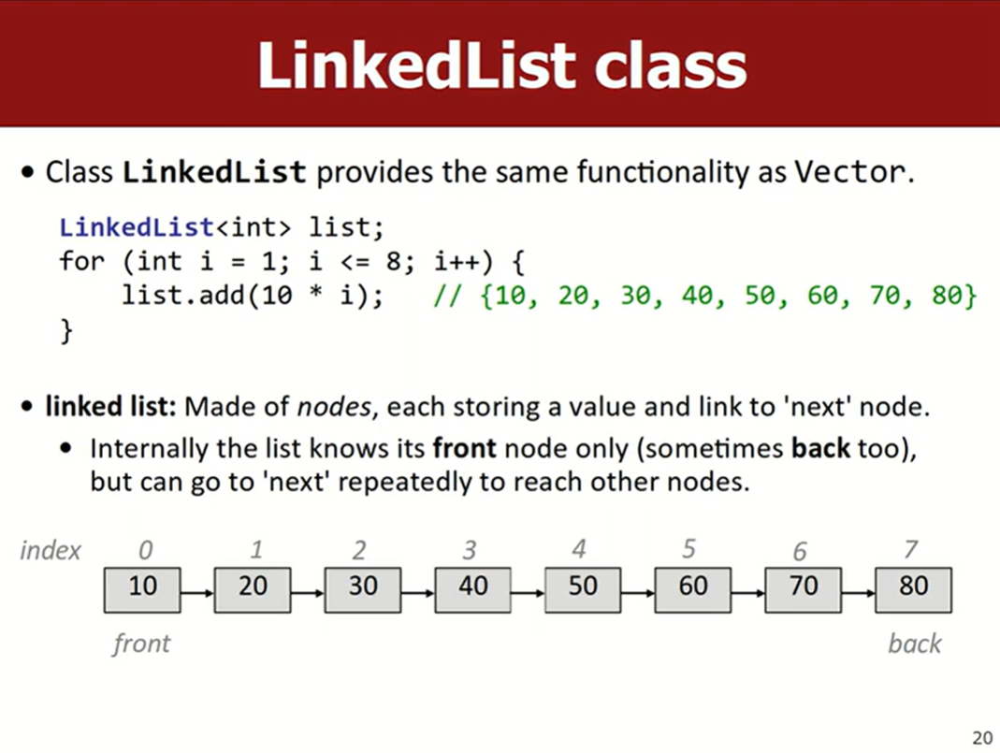
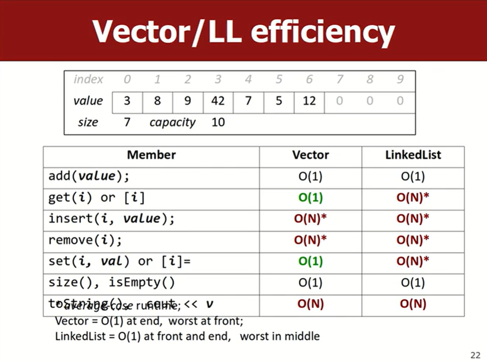
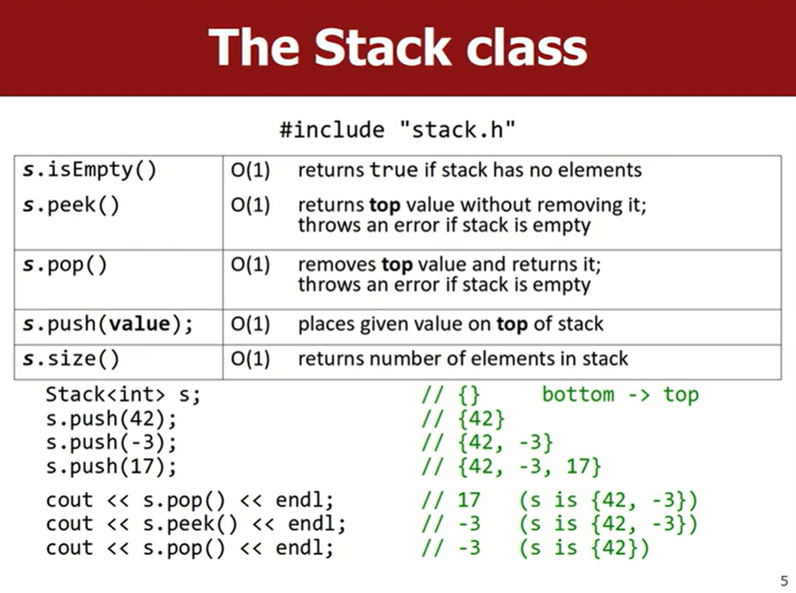
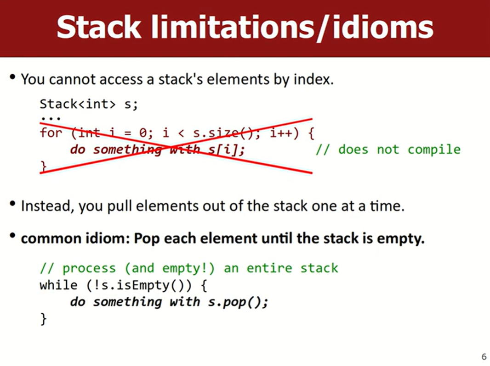
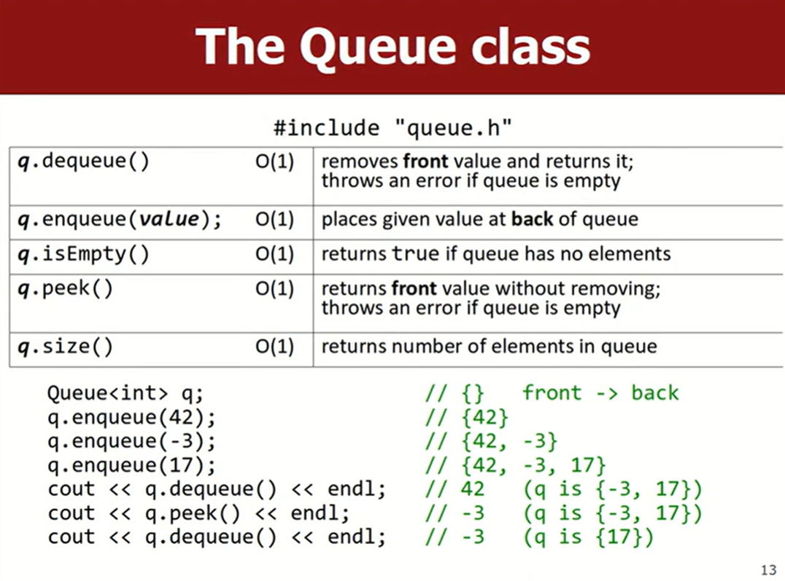
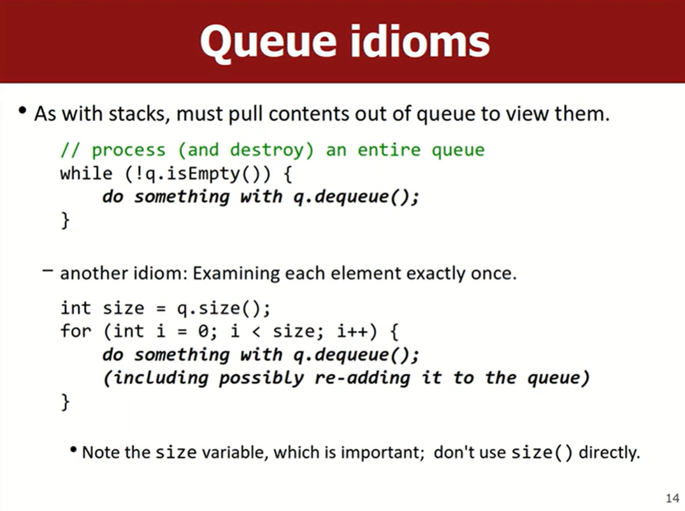
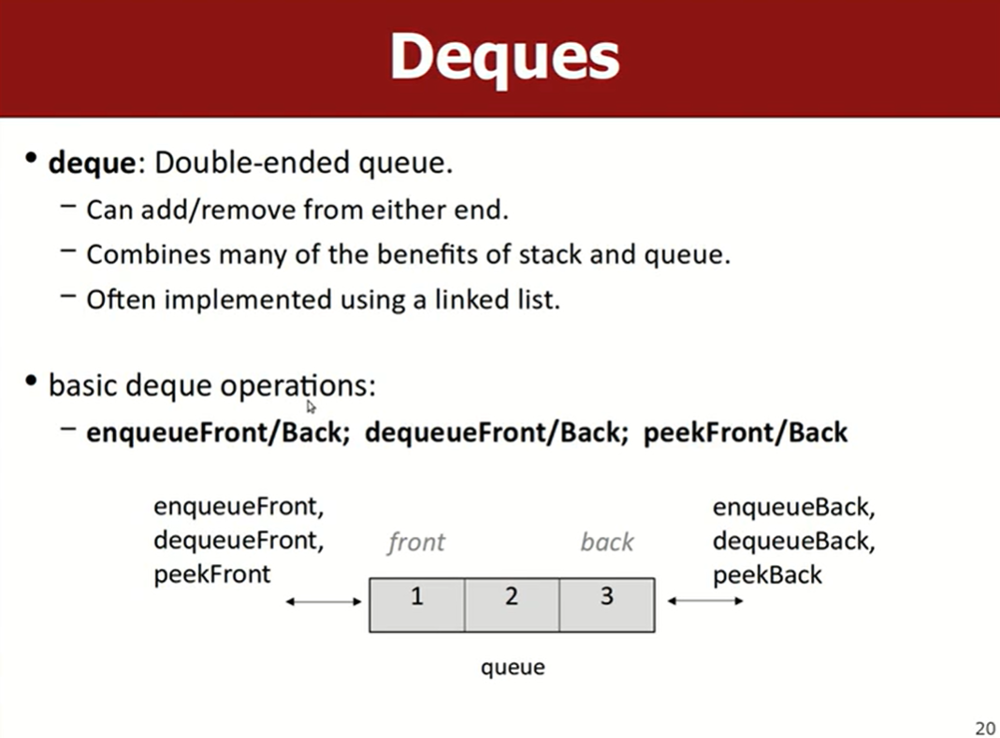
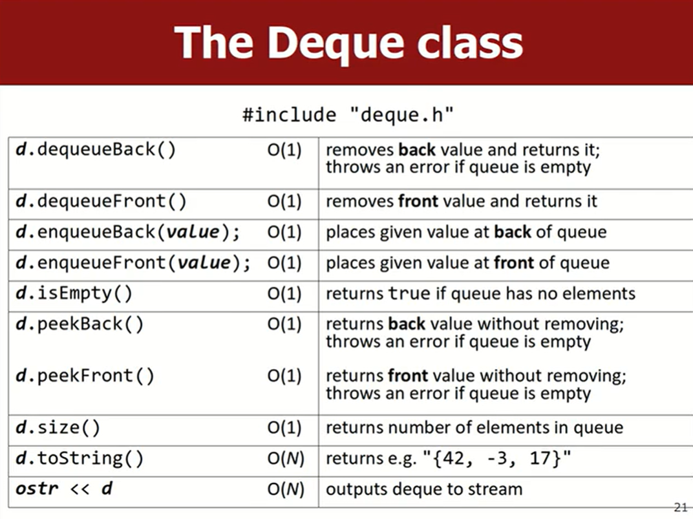

# Lec5_Stacks_and_Queues
💻lec5练习题：
#### stack
- [x] [1. stackMystery1](https://www.codestepbystep.com/problem/view/cpp/collections/stackqueue/stackMystery1)
- [x] [2. checkBalance](https://www.codestepbystep.com/problem/view/cpp/collections/stackqueue/checkBalance)
#### queue
- [x] [3. stutter](https://www.codestepbystep.com/problem/view/cpp/collections/stackqueue/stutter)
- [x] [4. mirror](https://www.codestepbystep.com/problem/view/cpp/collections/stackqueue/mirror) 练习queue的`push, pop, front`

- `#include "linkedlist.h"`
- [SPL LinkedList](http://www.martinstepp.com/cppdoc/LinkedList-class.html)
- 抽象数据类型ADT。一个list的ADT可以有不同的实现，如vector、linkedlist


### Stacks
C++标准库与SPL的不同：

| | C++标准库 | SPL |
| --- | --- | --- |
| 头文件 | `#include <stack>` | `#include "stack.h"` |
| 声明一个栈 | `stack<int> s;`(省略了std::) | `Stack<int> s;`(大写) |
| pop()弹出栈顶元素 | `pop()`没有返回值 | `pop()`弹出栈顶元素的同时，返回栈顶元素的值`int top = pop();` |
| 返回栈顶元素 | `top()` | `peek()` |
| 检查栈是否为空 | `empty()` | `isEmpty()`


- `include "stack.h"`
- 注意斯坦福库里是大写`Stack`
- push、pop、peek
- 应用：迷宫求解器、撤销(undo)

- 遍历栈（遍历结束后栈为空）

写一个课堂代码：
[checkBalance](https://codestepbystep.com/r/problem/view/cpp/splcollections/stackqueue/checkBalance)
```cpp
int checkBalance(string s) {
    Stack<char> parens;
    for (int i = 0; i < s.length(); i++) {
        if (s[i] == '(' || s[i] == '{') {
            parens.push(s[i]);
        } else if (s[i] == ')') {
            if (parens.isEmpty()) {
                return i;
            }
            char top = parens.pop();
            if (top != '(') {
                return i;
            }
        } else if (s[i] == '}') {
            if (parens.isEmpty()) {
                return i;
            }
            char top = parens.pop();
            if (top != '{') {
                return i;
            }
        }
    }

    if (parens.isEmpty()) {
        return -1;
    } else {
        return s.length();
    }
}
```
这个【检查括号是否正确闭合】的练习很好地展示了stack的作用

### Queues
- `#include "queue.h"`

- 一般不会用array来实现queue（因为array从front插入或移除元素都是$O(n)$）。而是用linkedlist，保证enqueue和dequeue操作都是$O(1)$
- 遍历Queue

写一个课堂练习`mirror`：
[mirror](https://codestepbystep.com/r/problem/view/cpp/splcollections/stackqueue/mirror)
```cpp
void mirror(Queue<string>& q) {
    Stack<string> stack;
    int size = q.size();
    for (int i = 0; i < size; i++) {
        string s = q.dequeue();
        stack.push(s);
        q.enqueue(s);
    }

    while (!stack.isEmpty()) {
        q.enqueue(stack.pop());
    }
}
```

- 双向deque



---

