# Lec6_Sets_and_Maps
> 💻课堂练习：
> - [x] [1. setMystery](https://www.codestepbystep.com/problem/view/cpp/collections/set/setMystery)
> - [x] [2. wordCount](https://www.codestepbystep.com/problem/view/cpp/collections/set/wordCount)
> - [x] [3. isHappyNumber](https://www.codestepbystep.com/problem/view/cpp/collections/set/isHappyNumber)

#### 练习3：快乐数
> 快乐数好耶:)

```cpp
int sumOfSquares(int n) {
    int sum = 0;
    while (n != 0) {
        int digit = n % 10;
        sum += digit * digit;
        n /= 10;
    }
    return sum;
}

bool isHappyNumber(int n) {
    unordered_set<int> seen;
    
    while (n != 1 && seen.find(n) == seen.end()) {
        seen.insert(n);
        n = sumOfSquares(n);
    }
    
    return n == 1;
}
```

> [!note]
> **力扣二刷时出现的问题**：
> 
> 调换了在集合中insert(n)与更新n为平方和的顺序，导致结果出错。
> ```cpp
> while (n != 1 && seen.find(n) == seen.end()) {
> 	n = sumOfSquares(n); // 先更新n
> 	seen.insert(n); // 再将新的n加入集合
> }
> ```
> 原因是每次循环我们要判断更新后的平方和是否已经出现过，如果一更新就放入集合，那下次无法进入循环。比如判断19，会先计算$1^2 + 9^2 = 82$，然后将82放入集合。下次循环判断82是否不在集合中，答案是false，循环结束，这显然不对。


### Sets
> Set存储不重复元素

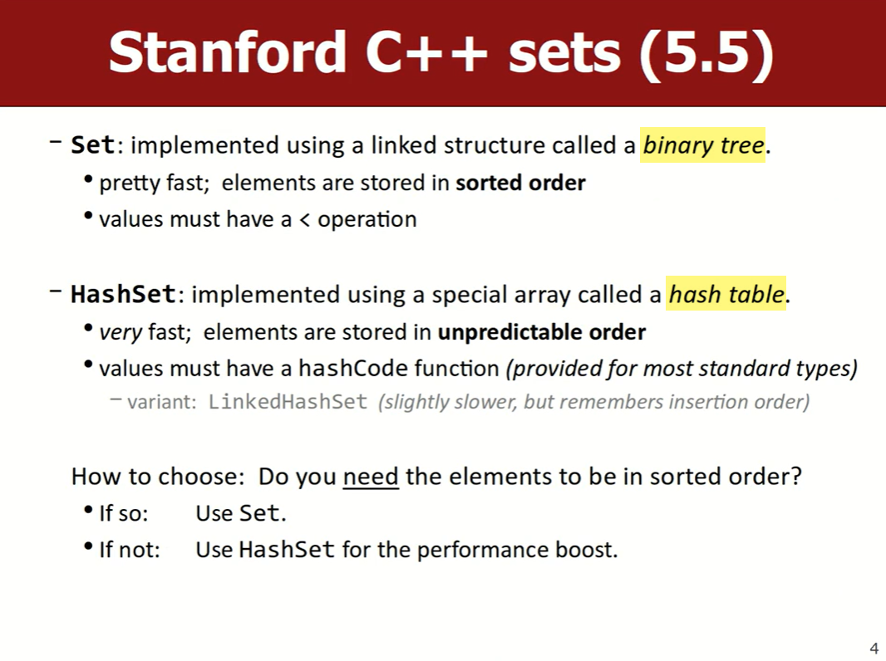
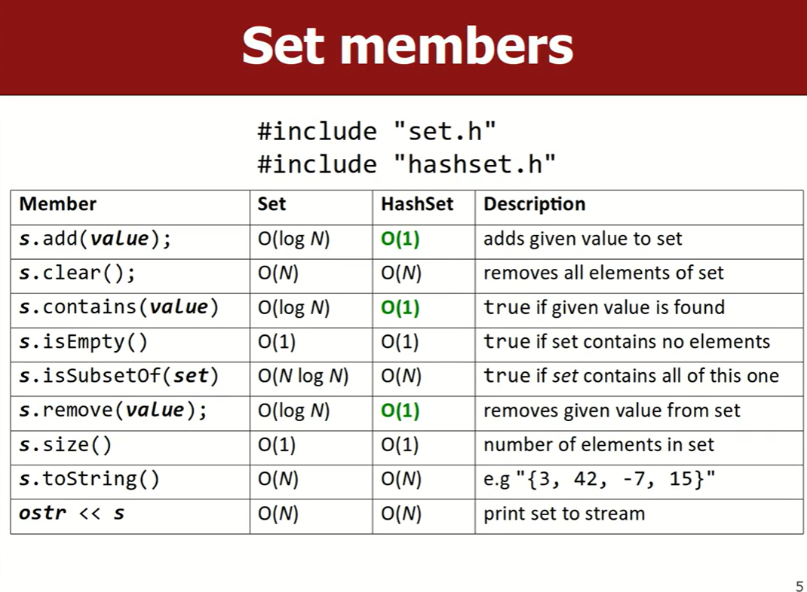
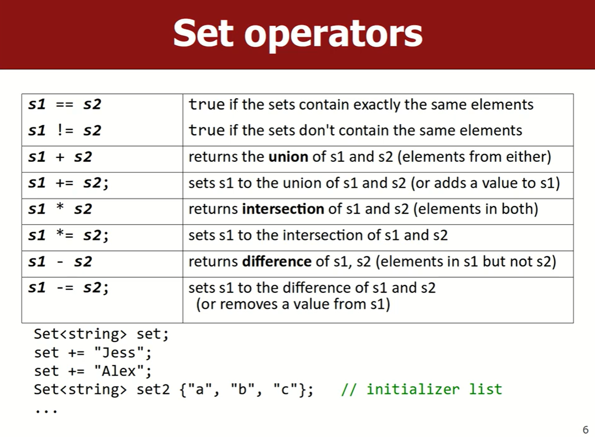
- `set.h` & `hashset.h`
- 遍历Set用for-each循环
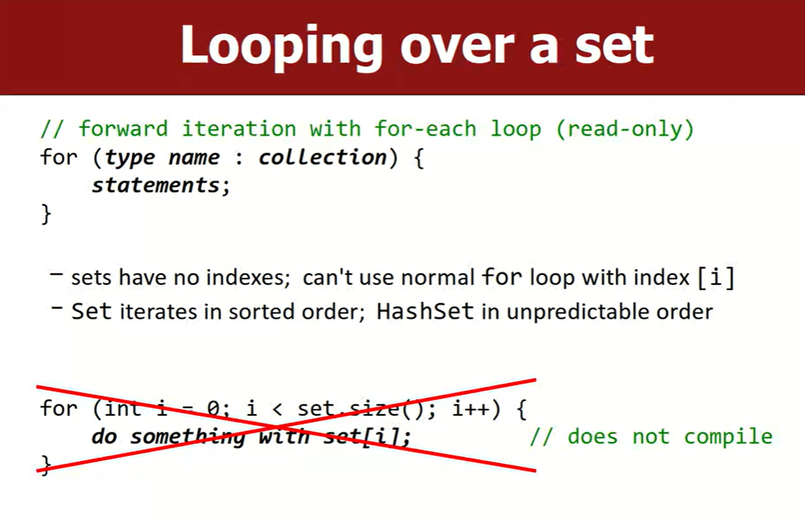
#### struct
> 当尝试在Set中加入用struct自定义的数据类型时，编译会出错，因为向Set中加入元素时会进行排序，而编译器并不知道该如何对自定义的数据类型排序。这时需要**操作符重载**

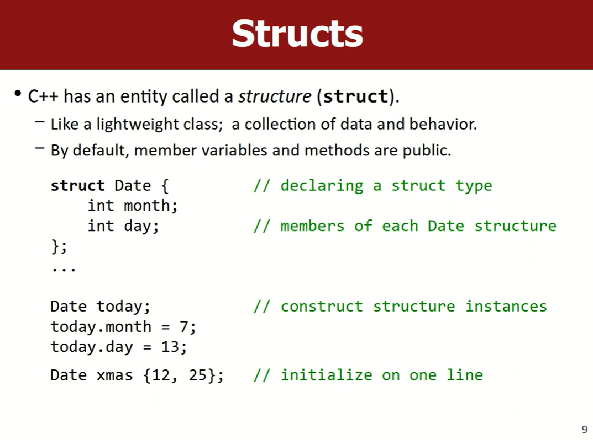
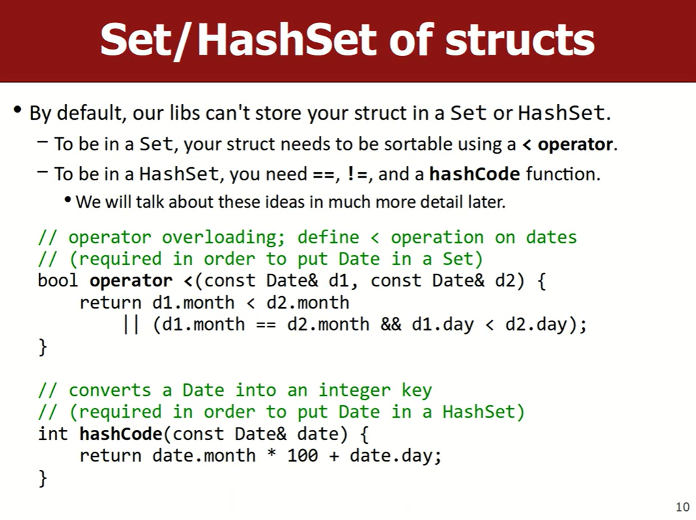
对`operater <`进行重载后，可以比较Date的大小

#### Set练习：统计不重复的单词数
```cpp

```

#### lexicon
- 相当于`Set<string>`
- lexicon按字典顺序存储string
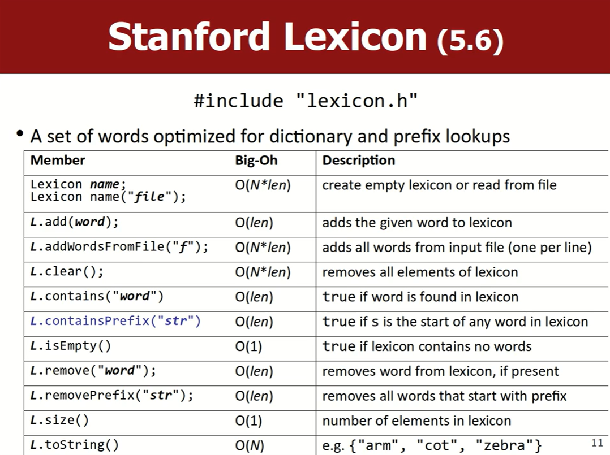
- lexicon由前缀树(Prefix Tree)实现，因此有`containsPrefix("str")`

### Maps
- 存储键值对(pairs)
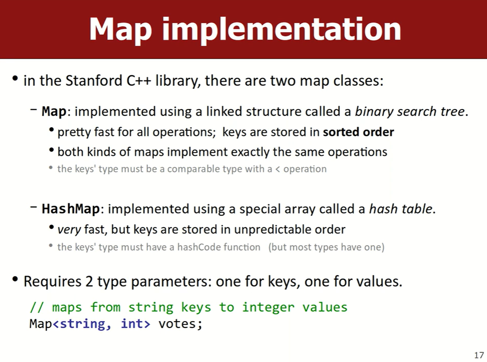
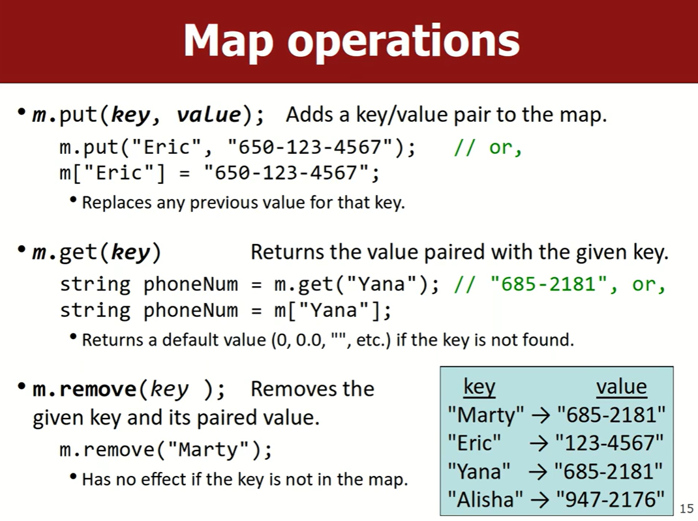
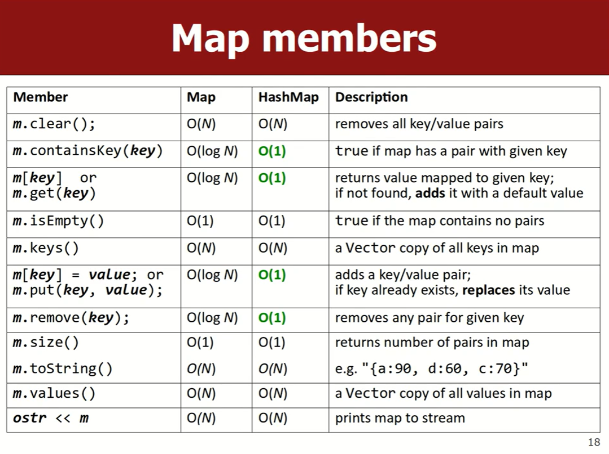

#### 练习1：统计每个单词出现的次数
```cpp
void wordTally(const string& filename) {
	cout << "Reading" << filename << " ..." << endl;
	// Todo
	Map<string, int> counters;

	ifstream input;
	input.open(filename);

	string word;
	while (input >> word) {
		word = toLowerCase(word);

		// Todo
		if (!counters.containsKey(word)) {
			counters.put(word, 1);
		} else {
			int count = counters.get(word);
			counters.put(word, count + 1);
		}
	}

	while (true) {
		string word = toLowerCase(trim(getLine("Word to search for ")));
		if (word == "") {
			break;
		} else {
			// Todo
			int count = counters.get(word);
			cout << word << " occurs " << count "times." << endl;
		}
	}
}
```
第二个Todo的if-else语句可以替换成简单的一句`counters[word]++`。因为SPL中的Map在用`m.get(key)`或者`m[key]`访问不存在的key时，会返回0（因为value是int

#### 练习2：anagrams
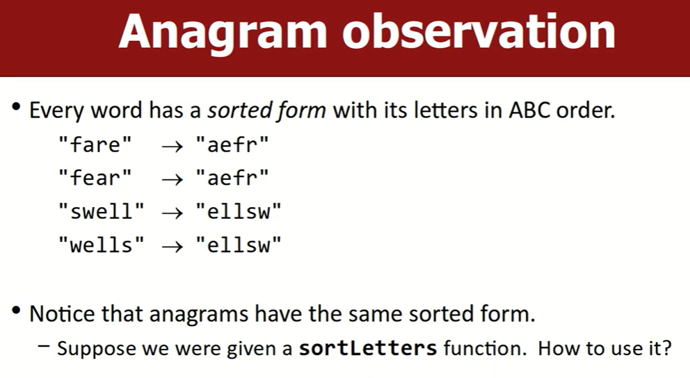
```cpp
int main() {
	cout << "Gathering anagram data ..." << endl;

	// Todo
	Map<string, Set<string>> anagrams;

	ifstream input;
	input.open("scrabble-dictionary.txt");
	string word;
	while (getline(input, word)) {
		// Todo
		string sorted = sortLetters(trim(word));
		anagrams[sorted].add(word);
	}

	// Repertedly prompt the user for words to look up in the map
	while (true) {
		string word = toLowerCase(getLine("Type a word [or Enter to quit]: "));
		if (word == "") {
			break;
		} else {
			// Todo
			string sorted = sortLetters(word);
			cout << anagrams[sorted] << endl;	
		}
	}
}
```

---

